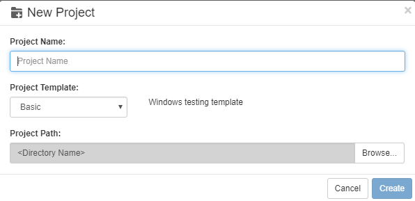

# Create Project

Projects can be created in the Script Editor. A LeanRunner project is a directory that contains scripts and object model files for multiple script files. LeanRunner provides templates for creating automation projects:

The Windows template provides the user with an empty object model file \(\*.tmodel\) and a Node.js script file. In addition, package.json can be used to configure other third-party NPM package dependencies.

