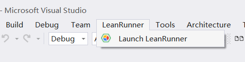
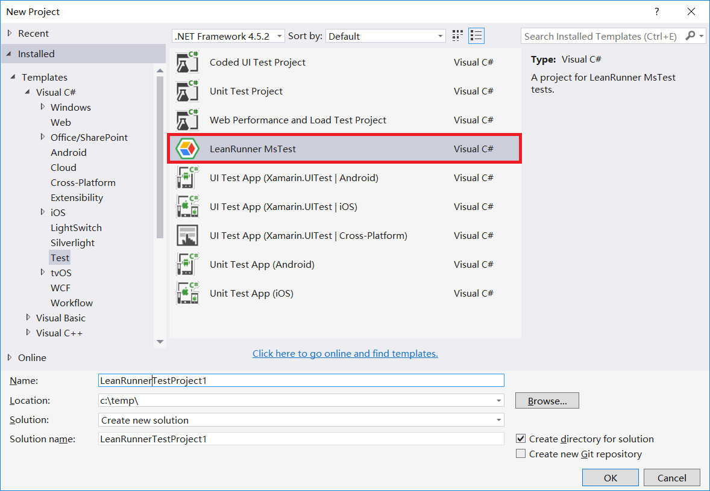
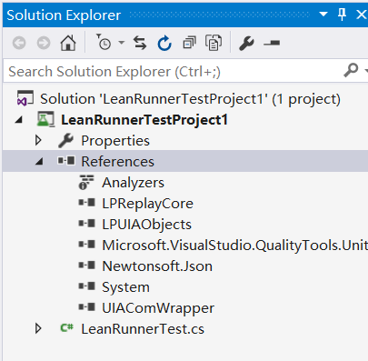
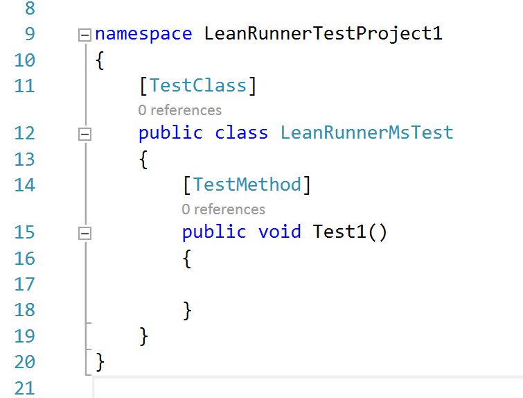

# Visual Studio Integration

## Menu Itegration

LeanRunner has Visual Studio IDE integration, and it supports Visual Studio 2012, 2013, 2015 etc. Users can click LeanRunner menu in Visual Studio, and click "Launch LeanRunner" menu item, to open Model Manager, as shown below:

With Model Manager, you can add/edit test models and spy objects etc.

## C\# Project Template

LeanRunner also installs test project template in Visual Studio, which users can use create C\# automation test projects in Visual Studio. Click "New" =&gt; "Project", then this template can be found under the "Test" project folder, as shown below.

After creating a new project with this template, you can edit C\# code. As you can see in the Solution Explorer, the newly created project has added a appropriate references and the first source code file to use.

Open the LeanRunnerTest.cs file and see that the project template has generated the following code:

To learn how to develop automation test code, see the[Code Generation](https://github.com/cuketest/leanrunner-user-guide-en/tree/e119a10b5bafdad4213817e282a4271dfb9a38bc/4_code_generation.md) and [run](1_2_run.md) sections.

