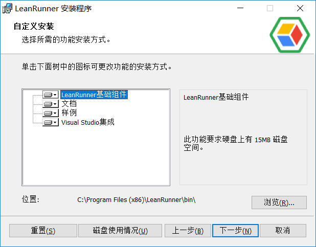
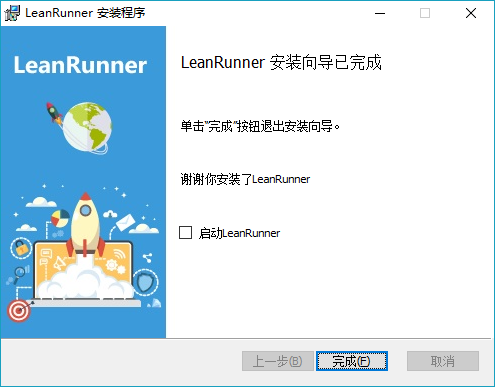

# Installation

## LeanRunner Lite

Installed from the Windows 10 app store. The Windows Store also automatically installs an updated version of the application.

## LeanRunner

LeanRunner is a full-featured version that runs on all versions of Windows, including Windows 7, 8, 10 and more. Its installation package is the msi.

Users can select the components needed by customize installation:

There are the following components:

* Core component：mandatory part，which includes Model Manager\(Application Model Manager\), execution engine etc.
* Help document
* Samples: Sample applications as automation scripts
* Visual Studio Integration：the part that integrates into Visual Studio, can be integrated into Visual Studio 2015、2013、2012 etc. If the system doesn't have any Visual Studio installed, this option will not be displayed.

At the end of the installation, you can select "Start LeanRunner" to launch the application.

