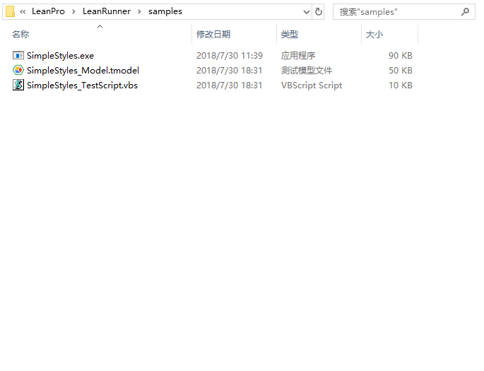
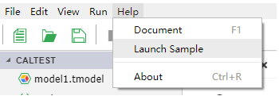
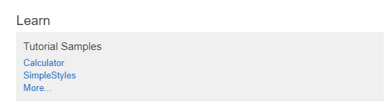

# Samples

## SimpleStyles

SimpleStyles sample has all the typical control types. The installation package provides scripts and object models for automating it. The list of sample program and test scripts are shown below.

Run the sample steps. 1. Windows =&gt; Run, input "cmd" to open command prompt window 2. Use "cd" command，and change dir to "C:\Program Files \(x86\)\LeanRunner\samples" 3. run SimpleStyles.exe on command prompt 4. run "cscript.exe SimpleStyles\_TestScript.vbs" on command prompt, it will run the automation automatically.

On LeanRunner Lite, sample can be opened from "Help" =&gt; "Launch Sample" menu:

## Sample Scripts

Sample scripts can be obtained from the welcome page, as showing below:

Clicking on a sample on welcome page will open a dialog box for selecting a folder. When a folder is selected, the sample code will be copied to the folder \(including the directory\) and the sample project will be opened.

The current installation package comes with the following samples:

* Calculator \(Windows 10 Calculator\)
* SimpleStyles

More sample programs are available on the [LeanRunner Github](https://github.com/cuketest/leanrunner) site.

