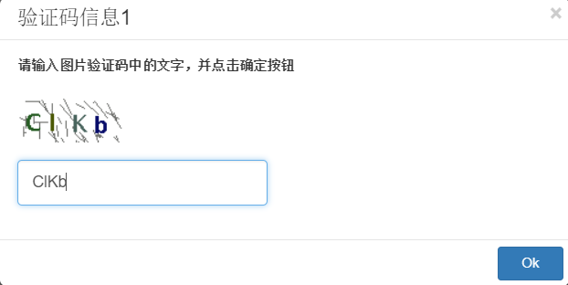
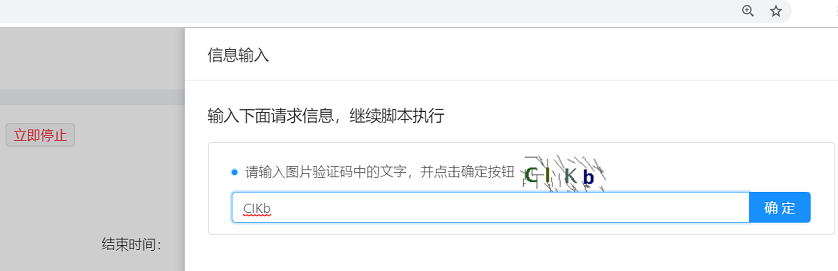
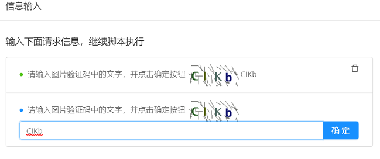
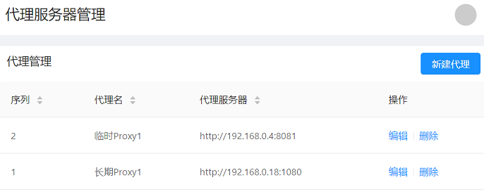

# Framework API

LeanRunner provides a set of framework APIs to drive the execution of RPA scripts.

Framework APIs can be found in “leanrunner” builtin packge. The following sample import some APIs from this library.


```javascript
const { step, scenario, Workflow, askInput } = require('leanrunner');
```

## Workflow API

The Workflow API is used to define steps and scenarios in automation scripts. With these APIs, you can describe the workflow steps and scenarios in natural language and present the execution process and results in a more readable way.

### 1. step

`step` is a workflow API, which defines a step in a workflow. It takes 2 parameters, step text and step functions.

```javascript
   async step(title: string, action: async (world: World) => Promise<void>)
```

Because most automation actions are now async, the `step` API as well as step function are async, the same is true for other workflow APIs. It means that in order for steps to run in sequence, you should `await` each step call. 

### 2. scenario

The scenario function defines a scenario in workflow. A scenario is a sequence of steps that performs meaningful to user. It also takes 2 parameters, title of the scenario and an async function. Inside this function, multiple `step` calls can be made.


```javascript
   async scenario(title: string, group: async () => Promise<void>)
```

### 3. run

`step` and `scenario` are workflow API, can be accessed using Workflow object. They are also able to be called directly without “Workflow.” prefix.

Another workflow function is `run`, which takes a function as API and call this function as the workflow. There can be multiple `step` and `scenario` calls inside the function.

### The role of workflow API

The workflow API can report the steps executed during the execution process. This information is recorded in the execution log file end with the extension .json.log. It and can be used to analyze the execution flow, interval time, error information, and so on. In addition to the descriptive information in step/scenario text, one or more attachments can be added to each execution step, including:

1. plain text
2. JSON objects
3. images

These information content can be displayed in the execution report. In Designer, the content of the workflow report can be displayed in the following ways:

1. When executed as a project, a *.json.log file is generated, which is a log file containing json content. It can be used to generate html or other formatted reports in LeanRunner Designer or on Server.

2. When executed as a project, an html report is generated by translating *.json.log file, and the report will be shown in a new window after the project execution is finished. It display all the scenarios and steps information, all the attachments, as well as statistics information in the report.

3. Step information will be displayed in Designer's output panel when executing a single js script file, or when executing a project, but the image attachments will be displayed as a placeholder.

## Other Framework APIs

### askInput

`askInput` can be used in attended mode RPA automation. In some cases, a RPA automation script needs to extract some input from the user during execution to continue executing subsequent scripts. `askInput` requests user to enter some input, and then the RPA script can continue its work with the given information. 

The following is the definition of the API:

```javascript
export async function askInput(inquiry: InputInquiryInfo): Promise<any>
```

It receives `inquiry` parameter, and return a Promise of user input, or when user does not repond, returns a Promise of default value when wait seconds time out. The `inquiry` parameter has the following structure:

```javascript
interface InputInquiryInfo {
    title?: string,
    message: string,
    prompt?: string,
    defaultValue: string,
    base64Image?: string,
    waitSeconds: number
}

```

Call askInput and pass in the prompt text or image, then it will display the parameters on the relevant interface during execution. If executed in Designer, it will pop up a dialog showing these info.

The following is the description of the parameters:

* **message**: prompt message
* **title**: optional, the dialog title
* **prompt**: optional, information displayed in the input box when there is no input
* **defaultValue**：optional, the default value preset in the input box
* **base64Image**：optional, base64 encoded image file
* **waitSeconds**：optional, The dialog wait time. If set, askInput will return after the wait time has elapsed. If it is not set, it will wait infinitely.

Note:

* There are ways to get the base64 encoded image for base64Image parameter. When automate with Selenium web, one can call[driver.takeScreenshot()](https://seleniumhq.github.io/selenium/docs/api/javascript/module/selenium-webdriver/index_exports_WebElement.html). When automate in Windows, one can call the [takeScreenshot()](/node_api/shared_api.md#takeScreenshots) of test object. To read from a image file, one can call `fs.readFileSync()` to read the content into a Buffer, and then call `buf.toString('base64')` to convert it to base64 image tring.

* The waitSeconds and defaultValue parameters can be used together. If user responds, the value set by the user is returned. If the user does not respond within the set time interval, the default value is returned.

The sample code is provided below:

```javascript
    let inquiry = {
        title: 'Captcha Information',
        message: 'Please enter captcha text in the image and click the OK button', //required
        prompt:'the captcha text',
        defaultValue: 'CIKb',
        base64Image: 'iVBORw0KGgoAAAANSUhEUgAAAF4AAAAmCAIAAADCwbuVAAACS0lEQVR42tWaMW7DMAxFOXTo0FsU6GFygg5Ftw5divb+gxPAReCKEvX5SUluoCGwI5l6/iIpKrIt+nz/fG3n/sjCGZ6cjrSMRlpwhkRHo0s6aIm/88nCqXbZL+bSkZTVdBSRa9qcCtJvDfQ1xpvsXrQn07rrvU7QkbjwWnRA67vmtgARdGajIRaUl473ESl0JMtpadNxbePmVulkaeqMaOLBZQSdNDSaDuJEErOSlOU2Cg0x22l0CJEmoyFSwZTUEaRTPMt+IoTm5e1ZN9u+y+vD3k5FR++BeDRVKAgdF5rC+svH+94qwzau03HNoCPGWAWFYpRcNMfxW2i6XB6fPveG0+mjqXqpQh0utWs0eMCqokH0YqCx6VRtk2rovX3RCyeIBqej0YDryEZjJxzaNmmB1A5lAppfF/4XDe5fImgcvmYEGjC/OKJx+d0jmvv3LqkcNHjpLwWNNx4dcRSNoMOrxhaREaG6GXCBhlDNnQVIJ4rGtRMBgze4oCK+hhZOH02LjguNa6dXdcN0hMJ9c2GMGCW7JWh0hMLpLEBTBeTKhv8FmsIesW3N2kO5KpJGNkxsFIhkB0JjAEpZUDgam84+CB2heDRcrQwM9jga45ZG48prUDTdQgY4VRoNV/27/YzLhqeqxiiscRVv16vKOt4dtaDukY5DswXOqnDhL/Y1NJpq4dKFxlucTiub00eO9FNAOmB9s1s8H4tm8x/ddZ1I4oG/PWb+YQuY8npH0M4rBY0x5iQ0kYiDFCvjdFaqhvjviNEr/Z9rutcVYxT9LFz5RWAAAAAASUVORK5CYII=',
        waitSeconds: 30
    }
    let inputString = await askInput(inquiry);
```

The following dialog is displayed when executed in the designer:



If executed on the LeanRunner server, shows the following UI:



Multiple users can access the server via browser. Only the user who initiated the execution can log in to the browser to receive the notification of the dialog box. If multiple scripts are executed concurrently (on different agent machines), or if multiple calls are called in the script, all requests are displayed on the server, in the order of calling time.

For example, the script calls multiple `askInput`, and the server shows multiple such notifications:




### getServerConfig

`getServerConfig` is used to obtain information about some configuration data on the server side. When the RPA is executed, some data needs to be stored and manipulated on LeanRunner server side. For example, the username and password for logging into a website can be stored on LeanRunner server, to be updated separately from the RPA script, and is also safer than storing in script. When the script is executed, they can be obtained from the server. There can be also other types of dynamic configuration data, such as proxy servers, data for data-driven scripts, and so on.

The function has the following definition:

```javascript
function getServerConfig<T>(configName: string, defaultValue: T): Promise<T>;

```

Executing this API in the LeanRunner Designer, it will not go round trip to the server, instead, it only returns the second parameter value directly, which is the default value. If not default value provided, just return null.

When runs from the LeanRunner, this API will automatically calls to the LeanRunner server to get the information.

Here is the sample code:

```javascript
let { getServerConfig } = require('leanrunner');
async function getProxies() {
    let config = await getServerConfig('proxies', { 'default': '112.64.53.107:4275' })
    console.log('server config', JSON.stringify(config));
    return config
}
```

The above getProxies function calls the `getServerConfig` API to get a list of proxy servers information from the LeanRunner server.

For example, the following Proxy is configured on the LeanRunner server:



Then the code sample above will return the following JSON Promise:

```json
{
    "Temp Proxy1": "http://192.168.0.4:8081",
    "Permanent Proxy1": "http://192.168.0.18:1080"
}

```

The user can then enumerate the returned proxy servers and select one that is needed.

