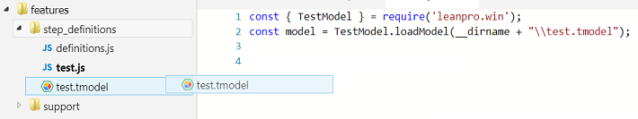
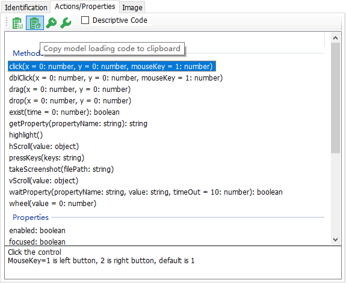
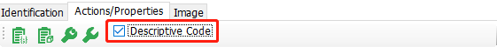
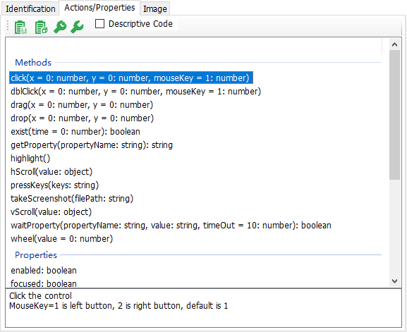
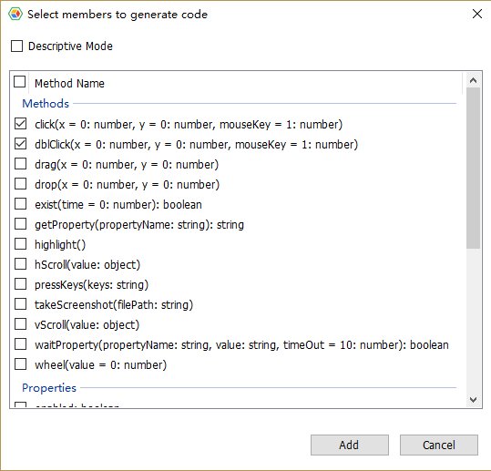
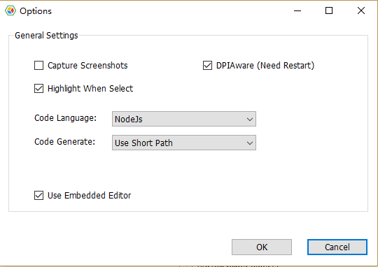

# Code Generation and Execution

## Generate Model Loading Code
When a test model is saved, it is saved with extension (*.tmodel). In an automation script, to use this model, you need to load the model first. Model Manager can generate code snippet to load the model, which avoids manually typing this part of the code. There are 2 ways to create model loading code:

1. Drag and drop the model file directly from the file browsing panel into the code editor:

   
   The code that loads the model will be generated.

2. On Model Manager, click "Actions/Properties" tab on the right, click the button below, and automatically copy the model loading code to the clipboard.



Open code editor, and paste the code:

1. Node.js
   ```javascript
   const { TestModel } = require("leanpro.win");
   var model = TestModel.loadModel("C:\\temp\\vbtest\\BuildYourOffice.tmodel");
   ```

2. VBScript (LeanRunner only):
   ```VBScript
   Dim auto
   Set auto = CreateObject("Win.Automation")
   Dim model
   auto.LoadModel("C:\\temp\\vbtest\\BuildYourOffice.tmodel")
   ```
   
## Model Dependent Code and Descriptive Code

Model Manager can generate two types of code：
* **Model dependent**：This type of code needs to load the model, and code will looks up the objects in the model by name.

For example, the following statement, looking for the "SimpleStyles" Window object from the model, and looking for the "Normal1" CheckBox object under the parent object, and then click this Checkbox.

```VBScript
model.GetWindow("SimpleStyles").GetCheckBox("Normal1").Click 0, 0, 1
```

* **Description mode**: Description mode means that the properties information of test object is put in the code, and model file is not needed during run.

If check the "Descriptive Mode" CheckBox ，the code generated will be descriptive mode, otherwise, it is model dependent.

## How to Generate Code
There are 3 ways to generate code for object actions or properties:

### 1. Drag operation signature

1. Click one of the methods in the "Actions/Properties" panel to select the item.

2. Drag and drop the selected method or property into the editor to  generate code automatically.

### 2：Copy/paste

1. Select one Action or Property, click button, the code generated will be copied to clipboard.
2. Open the code editor, and paste it into your code.

### 3：Drag/drop test object
Another way is to drag and drop the nodes in the test object tree directly into your editor (it is required that the code editor support text drag and drop). When the drag and drop is complete, a dialog will show up, displaying all the actions and properties of the test object, as shown below:



You check the method call you want, click OK, and the call code is placed in the corresponding location of the file being edited. You can also choose whether to generate a descriptive mode code on this dialog.

## Code Language

In LeanRunner, Model Manager supports multiple languages, so choose your expected language before generating the code. To do this, click on the "Actions" => "Options" dialog, set the language of the code you need to generate, and click Save.



In CukeTest and LeanRunner Lite, only Node.js is supported, so this setting is read only.


