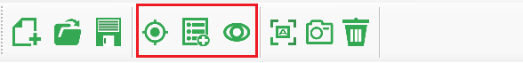
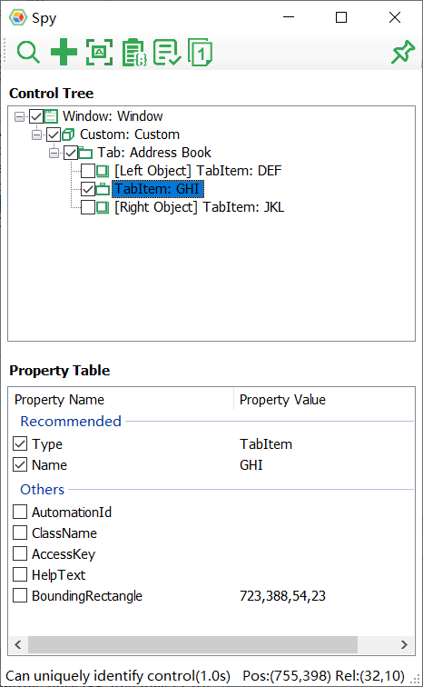
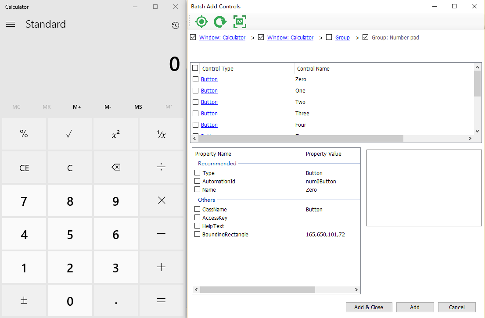
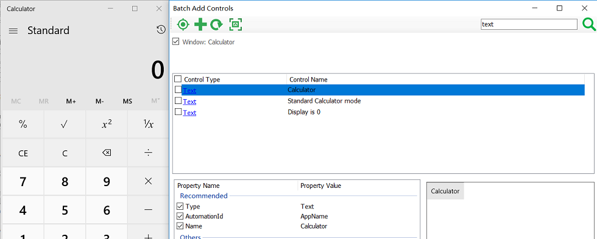
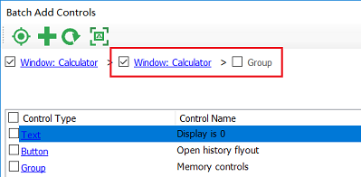

# Control Spying

Model Manager provides several ways to identify one or more controls and add their test objects to the model:

1. Add Object
2. Batch Add Objects
3. Spy

The 3 buttons on the toolbar corresponds to the above 3 ways of adding objects:

## 1. Add Object

Used to identify a single control and add its test object to the Test Model.

When "Add Object" is clicked, Model Manager hide itself so that the user can click on the control to add the left mouse button on the screen. The model manager will detect the control and display the following dialog:

Among them:
* On the upper half of the tree structure, check those nodes that are helpful for recognition of controls. Model Manager has automatically made some choices for users, for example, it will not select those container controls that do not have useful properties are not selected by default.
* The control user clicked is displayed as a leaf node on the tree. its immediate left and right control are also displayed in the tree structure. It is likely that these left and right controls is also be needed. Users can also check them if needed.
* Each node has a set of properties, you need to select the properties that can just uniquely identify the control. For example, `AutomationId` is typically set by the developer to uniquely identify the control. If it is, you can just select AutomationId. Otherwise, if the `ClassName` + `Name` property can uniquely identify the control, you can also choose both. The `Type` attribute is mandatory.

## 2. Batch Add

When there are many controls that need to be added to the model, it is cumbersome to spy and add controls one by one. You can add controls in batches by clicking on "Add Batch Controls" in the menu. The method is to click the  button on the toolbar of the Model Manager. When clicked, Model Manager window will be hidden, you select the one you want to add to the model. When a control is clicked, the "Batch Add Controls" window will pop up, as shown below:

For example, on the Calculator app, select a button control and Model Manager will list all controls that are on the same level as the the button on control hierarchy. On this control list you can check those you want to add to the model. For each control, when selected, you can also change the identification properties on the bottom of this dialog. After the selection, clicking "Add" button to add them to the model.

If you find that the spied controls are not what you really want to add, you can navigate to other levels of the hierarchical through the breadcrumb navigation bar on the top. The navigation bar lists all the direct parent controls of the current list controls.
If the control in the list is also a container control that has other child controls, clicking on its blue link will navigate into the container and display its direct child controls in the list. If it doesn't have a child control, clicking on its link won't cause any UI change.
When you click on any item on the control list, the image box in the lower right corner will also display a screenshot of the control, so that the user can clearly see which control needs to be added.

### 2.1 Search Controls

In Batch Add window, you can search for controls. Fill text in the search box to search for objects at all levels under the current breadcrumb control. The filled in text will be used to match the control type and control name. For example, in the following figure, in order to search all the text controls in Calculator, enter "text" in the search box and click Search, the text controls that appear in all Calculators will be displayed in the list box:

You can select the desired Text control and add it to the model.

It should be noted that the objects added directly by the search are listed directly under the selected breadcrumbs control, and there is no intermediate level controls. If you need intermediate level control to be added to the model, click on the link on the control, and its parent levels will appear. For example, when you click the "Display is 0" control in the above image, all its parent element levels will appear in the breadcrumbs control:

Now you can choose the parent control that did not appear in the initial search.

## 3. Spy

When you need to inspect different controls on the app under test and then decide whether to add them, you can use the Spy to view them and add them. The Spy can show always on top, and while mouse is moving on the desktop, the Spy will highlight the control that mouse cursor located. If you decide the control need to be added to model, click the left mouse button to stop spying. Then click the Add button on the Spy to add the test object to the model, just like you did for "Add Object" dialog.

## Other Tips

When the control you want to add is not directly visible on the interface, you need to press `Ctrl` key to complete the first few clicks. And, when the control you want to add finally appears, release `Ctrl` and click the left mouse button to select it. Hold left mouse button until the Add Object (or Spy) dialog detected the control you selected and then release the mouse button.

A typical scenario for this tip is menu control. If you want to add a submenu, hold down Ctrl on the menu control and open the menu. After the menu is displayed, release Ctrl and click left button, remember to hold left button for a couple of seconds, then you can add submenu items to the model.

