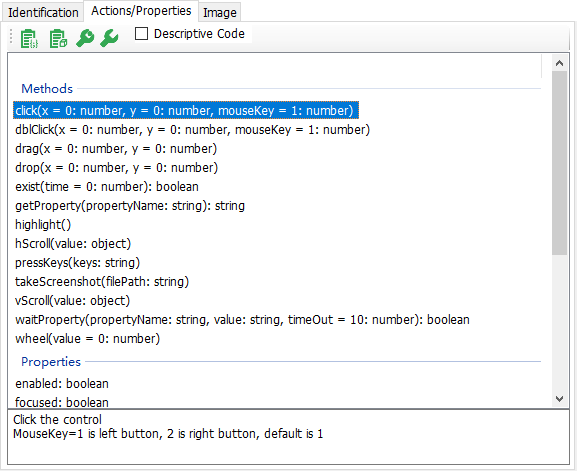

# Model Manager Introduction

Model Manager (MM) is used to manage test model, which is the tree structure of test objects. It can also identifies objects, and captures snapshots of controls. It is the main user interface of the software. Because this component is available in both CukeTest (Automation Test Products) and LeanRunner(RPA Automation Products), the interface are slightly different in different products. Please read the help documentation according to the product context.

MM can perform various editing operations on the information of the test object. After a test object is added to the test model, the user can drag in the tree structure to adjust its order. 

The model manager supports multiple languages (including Chinese and English) and can be switched in the menu. You need to restart the editor to take effect when you switch languages.

MM contains a variety of detection methods, please refer to [Detection Control and Object Addition](/control_spy.md).

The Test Object contains the property information of the control and can be used to locate the control.

The following figure is the user interface of the model manager:

## Test Model Tree

The left part of the model manager is the test model tree, which shows the tree structure of the test object. The top is the search control, the text is entered in the search control, and the control is filtered to display all matching objects and their parent objects. The matching logic uses the input text to match the name, type, and property values of the objects. the objects that contain the text is a substring of these values will be displayed as a result. The two buttons to the right of the search box are used to expand the entire tree structure or to collapse the entire tree.
For example, the figure below shows how the search results are filtered when the text "edit" is searched. Matching objects are shown as red.

## Object Edit Panel

When you click on any node in the object tree, the properties of this test object will be displayed on the left panel, as shown below.

* the upper part is the name and type of the display control. The name can be modified by the user to whatever friendly name. It does not affect the the identification of the control. It is used to locate the test object in the model. The type refers to the type of this control, it is read-only and cannot be modified.
* the upper part also has an area displays the screenshot of control, captured during spy.

The next section describes several tabs on this panel:

### 1. Identification Properties Tab

On the bottom part, the first tab shows the properties of the test object.

*  Add a new "Identification Properties" to the current object: the property should either come from "Other Properties" category, or some predefined property, e.g. "Index" property. When any existing properties combination cannot uniquely identify an object, the "Index" property can be added to select the nth object from it. The Index property starts from 0.
*  Delete a property of the current object: Select the attribute and click this button to delete it. Note that performing deletion on the identification property does not delete the property directly, instead it puts the property in the "Other properties" column. Because it is possible that you need to add it to the identification property later. This property will only be removed from this object if it is deleted for the "Other Properties" category.
*  Highlight this test object. It will only succeed if the application is open and the object can be recognizes from the application.
*  Update the properties of the test object from the application under test. In the case that the application has been updated to a newer version and a test object no longer matches, you can click this button and select the control on the new application that corresponding to the test object. Model Manager will regenerate the test object from this control and update the properties to the current one. Note that this operation has a constraint, during update the control you selected must be the same type as the type of the object being updated. If the control type changes, for example, from RadioButton to CheckBox, you cannot update the control in this way, you need to add a new test object to the new control.

### 2. Operations Tab
List actions and properties of the test object, and also allow users to test these operation and properties.

*  Select a method and click this button, the code snippet will be automatically copied to clipboard.
*  Copy the model loading code to clipboard. 

Each test object has multiple actions and properties. Different types of objects may have the same method properties, each of them typically have their own unique actions and properties.

Here is the way to find how to use an action or property: Selected a object, Model Manager will automatically list the operations this object supported. Clicking on an action or method, and you will find the description of it on the bottom information panel.

In Model Manager, to test its effect on the application under test, some methods of the object can be called directly. There are two ways to invoke, "Invoke Default" and "Invoke...":

*  Invoke a property or actions with default values.
*  A dialog box will pop up for entering parameters for the method, and then invoke the method.

### 3. Image Tab

Displays the control screenshot that is captured when the control was spied.

