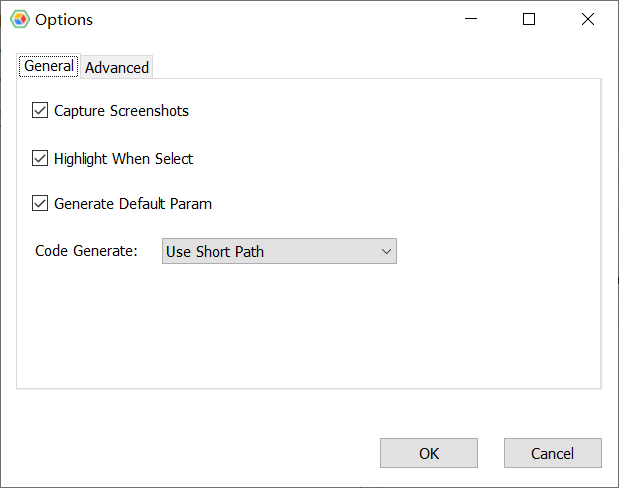
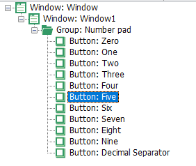

# Model Manager Configuration

Click "Actions" => "Options" in the Model Manager to open the configuration interface, as follows:



The options include：

### Screenshot capturing
Sets whether to automatically capture a screenshot of the control when it is added to the model and store it in the model. Screenshots enhance the readability of the model. For example, with the control image, you can know which control it corresponds to when viewing an object. The screenshots won't be used during replay.

### Highlight when selected
When an object is selected in the tree view, whether the corresponding control on the application is highlighted at the same time.

### Programming Language
The Model Manager can generate code in multiple languages, this option controls which language code to generate. Note that this option is disabled in CukeTest and LeanRunner Lite because they supports only node.js.

### Use the built-in code editor
The model manager has a simple built-in script editor, which can be used to test the automation code as needed.

### Code generation
When code snippet is made for an object, is it a short path or a full path.

"Short path" means when generating code, use only the direct object's name, not the parent objects, for example:

For the button "5" on the calculator, the object library has the following object structure:


Here is the short path code generated：
```javascript
model.getButton("Five").click();
```
Here is the full path code:
```javascript
model.getWindow("Window1").getWindow("Window2").getGeneric("Number pad").getButton("Five").click();
```
Both have similar outcome during replaying, and the short path is more succinct. To use the short path the user needs to ensure that the name of the object is unique in the model.
