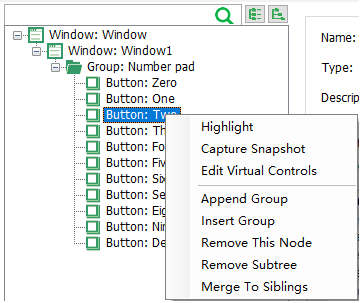
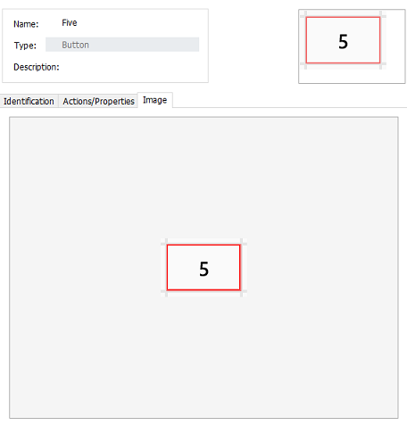

# Operations on Test Object

The test objects are displayed in the tree structure in the Model Manager. For each object node, there are the following related operations:

* Highlight
* Get control snapshot
* Edit virtual controls
* Create group
* Insert group
* Delete this node
* Delete subtree
* Merge to sibling node

## Highlight

The control corresponding to the test object is highlighted on the application under test, provided that the application is opened and the object is recognized.

Highlight button can also be clicked on the toolbar. On the model tree structure, select the object and click on the highlight icon. The corresponding element on the application is highlighted and the object is successfully identified. From the right side of the toolbar, you can also see whether the recognition was successful or not.

## Get control snapshot

Shows the screenshot of the corresponding control. This screenshot is the same as the screenshot thumbnail on the upper part. For some of the larger controls, it is helpful to see the full view of the control.

## Edit virtual controls

Virtual controls allow for finer-grained control by defining part of an interface as a control. See [Virtual Controls](virtual_control.md) for more information.

## Create Group

`Group` node are introduced to classify multiple controls. It is transparent to automation script during runtime. "Create Group" creates a child node under a the current object.

## Insert Group

Insert a group object as the parent of the selected object

## Merge to sibling node

Duplicate parent objects are introduced when LeanRunner merge the spied objects to the model. To remove the duplication, This action can be performed on the root node of duplicate object, LeanRunner will remove the duplicated object for current node and the sub tree. The model manager recursively merges child objects until there are no repeatable objects that can be merged at a certain level. The premise of merging is that two objects have the same identifying properties.

