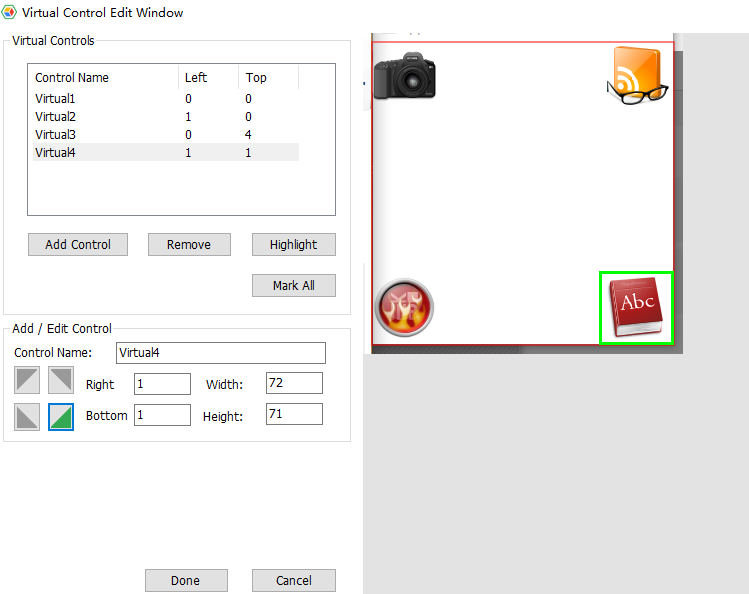
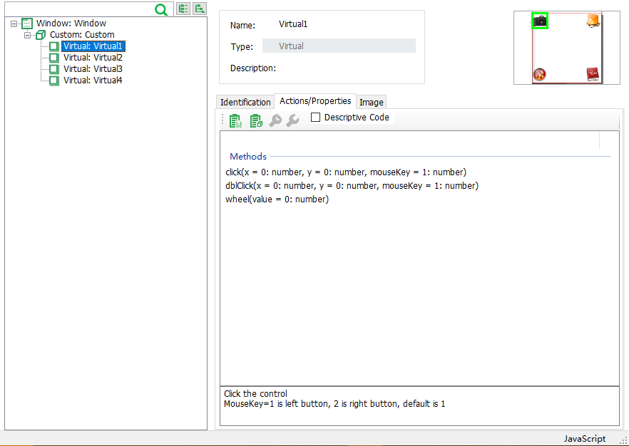

# Virtual Control

Virtual control allows for finer-grained control by defining a section of an interface as a control. For example, some applications use non-standard controls that cannot be added to the model by objects spy. One way to do this is to calculate the mouse clicking position relative to the parent control. Use coordinate to perform mouse click. However, this method of clicking is flawed:

1. The code is poorly readable
2. When the form is stretchable, the effective click coordinate position changes.

For this reason, virtual control are introduced.

The following uses examples to introduce the use of virtual controls.

QT has an animation sample program, appchooser, which has the following interface.


The image on the left is the interface when it is opened. When one of the icons is clicked, the icon will zoom in and show in the center.

To automate this application, first spy and add the form control to the model, then right click the Panel object in the model, select "Edit Virtual Control", which will open the Virtual Control dialog:



Then perform the following steps：

1. Add 4 virtual controls，name them as Camera、Glass、Ball、Book
2. Select the corresponding area on the image for these controls
3. Choose where to align. For example, the Book control selects the bottom right alignment, so that when the form is stretched, the virtual control still clicks on the icon in the corresponding position in the lower right corner.
4. Click "OK" to save the definitions for these virtual controls.

After finish editing the virtual controls：



You can see：
* The position of the virtual control in the parent control (Panel)
* Operations on the virtual control, which includes `click`、`dblClick`、`wheel`。

After generating code for the virtual control:

```javascript
//Node.js code:
model.getVirtual("Camera").click();

```

Can see that the code is quite readable.


### Virtual Control API

Virtual control has the following APIs:
* click
* dblClick
* wheel
* takeSnapshot
* findSnapshot

Among them, the methods `click`, `dblClick`, and `wheel` work the same as other controls. The `takeSnapshot` method only intercepts the screenshot of the virtual control drawing area.

#### findSnapshot
```javascript
findSnapshot(): string
```
findSnapshot API, You can take multiple snapshots of a virtual control and then determine which one belongs to it at runtime.

console.log(snapshotKey)

Here we have two snapshots on the virtual control, one called "checked" and one called "unchecked", which can then be used in the code:
```javascript
let snapshotKey = await model.getVirtual("Virtual1").findSnapshot();
console.log(snapshotKey)
```

When the control is checked, the above code prints "check", and when it is not checked, the print content is "uncheck". Returns null if the snapshot at runtime does not match any existing snapshots in the model.

#### matchSnapshot

```javascript
matchSnapshot(snapshotKey: string): boolean
```

Given the key value of the virtual control snapshot in a model, the API intercepts the snapshot of the virtual control runtime and returns whether it matches this snapshot.

