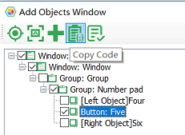
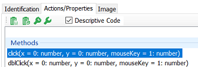
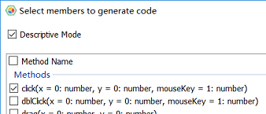

## Descriptive Mode

Descriptive mode is a way of constructing test objects directly through attributes in code, which is different from the way in which test objects are loaded from object model.


To use descriptive mode, one can use the "Auto" object exported from "leanpro.win", and call "get[ControlType]" methods on it. For example, Auto.getWindow(), Auto.getButton() etc. "get[ControlType]" method receives an object containing a collection of properties that construct a test object in an "AND" relationship to look up the control.

In the code in the following example, you can construct a test object directly from an attribute without loading the object model:
  
   ```javascript
    const { Auto } = require('leanpro.win');

    Auto.getWindow({
       "className": "ApplicationFrameWindow",
       "title": "计算器 ‎- 计算器"
    }).getWindow({
       "className": "Windows.UI.Core.CoreWindow",
       "title": "计算器"
    }).getGeneric({
       "type": "Group",
       "automationId": "NumberPad",
       "name": "数字键盘"
    }).getButton({
       "automationId": "num5Button"
    }).click();
   ```

In the above example, each call passes an object parameter. This object contains multiple key/value pairs, which are combined to form a filter condition to find the object.

The object returned by the descriptive mode call "get[ControlType]" has the same methods and properties as the object obtained in the object model.

The advantage of the descriptive mode is that you don't need to rely on the object model, you can dynamically build test test objects, or access dynamically created controls on the interface as needed. Its shortcoming is that it can't manage test objects centrally. You can't use Model Manager to modify or verify test objects, therefore it has bigger overhead of maintaining code. The descriptive mode can be used according to the needs.

### Code Generation

The code that describes the pattern can be keyed-in manually, but it is more convenient to generate it through the model manager. Here are some ways to generate code that describes the pattern:

1. Click "Add Object" and spy a control, "Add Object" dialog will pop-up, then click "Copy Code", the descriptive mode code will be copied to the clipboard:

   

2. In the test object editing interface, check "Description mode", then the code copied is the descriptive mode code.

   
   
3. When you drag an object directly from the object tree to code editor, the methods selection dialog pops up. Check the "Copy code" checkbox and the generated code is also the descriptive mode code.

   
   