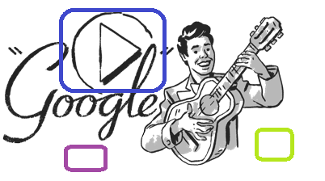
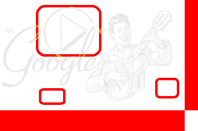
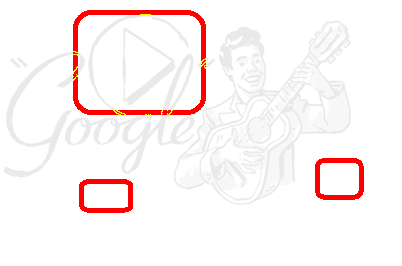

# Image APIs

The Image APIs are used to manipulate APIs, as well as verify results during automation, Primarily through `Image` objects. In addition, Virtual Control also has a related image APIs.

## Image Object

The `Image` object is used to get the property information of a image and used to compare images.

Image object has the following definition:

```javascript
    class Image {
        width: number;
        height: number;
        clip(rect: {x: number, y: number, width: number, height: number}): Image;
        drawImage(image: Image, x: number, y: number): Image;
        getData(option?: {encoding: 'base64' | null}): Promise<Buffer | string>;
        static fromData(bufferOrString: Buffer | string): Promise<Image>;
        static fromFile(filePath: string): Promise<Image>;
        static imageEqual(image1: Buffer | string | Image,
            image2: Buffer | string | Image, 
            options?: CompareOptions,
            compareInfo?: ImageCompareInfo): Promise<boolean>;
        static imageCompare(image1: Buffer | string | Image,
            image2: Buffer | string | Image, 
            options?: CompareOptions): Promise<ImageCompareResult>
    }
```

Obtain an instance of an Image object to get the properties of the image, or use the instance for subsequent processing.

Image instances can be generated from Buffer, base64 strings, or a file path, for example:

```javascript
   const { Image } = require('leanpro.visual');
   const fs = require('fs');
   (async function() {
       let buf1 = fs.readFileSync('c:/temp/image1.png');
       let image1 = await Image.fromData(buf1);
       console.log(image1.width, image1.height);

       let image2 = await Image.fromFile('c:/temp/image2.png');
       console.log(image2.width, image2.height);
   })()
```

The above example reads image data from Buffer and files respectively and prints their width and height.

> Note: Objects cannot be created directly with `new Image()`. Image instances need to be generated from `fromData` or `fromFile`. In addition, the Image object only supports images in PNG format for now.

**Instance members:**

* **clip** Used to clip the image and return the new clipped image. Pass in the rectangle to click, and clip the image according to the `x`, `y`, `width`, `height` defined. If the incoming data is invalid, for example, `x` value exceed the width, or the clipped width or height is 0, `null` is returned;
* **drawImage** Draw two images together and returns the newly drawn image. For example:

  ```javascript
  ...
  this.screen1 = await model.getButton("Five").takeScreenshot();
  this.screen2 = await model.getButton("Six").takeScreenshot();
  let image1 = await Image.fromData(this.screen1);
  let image2 = await Image.fromData(this.screen2);
  image1.height - 20 })
  image2.height - 20 })
  let combinedImage = image1.drawImage(image2, image1.width + 5, 0);
  ```

  The above code take the screenshots of two buttons, and cut off 10 pixels from the surrounding edges and draws them side by side with 5 pixels margin in between.

  If you want to draw two images one on top the other, you can use something like:

  ```javascript
  let combinedImage = image1.drawImage(image2, 0, image1.height + 5);
  ```

  You can also use the negative value of x, y, so that the second image draws on the other side of the image, for example, the following statement will draw the image2 on the left and image1 on the right:

  ```javascript
  let combinedImage = image1.drawImage(image2, -(image1.width + 5), 0);
  ```

* **getData** Returns the content data of the image, which can be saved to a file or added to a report. Note that it returns a Promise, so you need to add `await` before this method in the `async` function.

## Image Comparison

In the process of automation, one solution to verify results is to compare the screenshot of the concerned areas with the expected screenshot, to see whether there are any difference between them.

There are two main ways to get the image compare results:

* Compare image differences and return boolean values.
* Subtract the corresponding pixels of the two images to produce a result image, and mark the different points with colors. The resulting image is displayed in the report and can be viewed manually by the user.

The `imageEqual` and `imageCompare` methods of the Image object are provided for the above two ways respectively.

Because the operating system, resolution, and color settings may affect the display of images, the same controls may display differently under different settings. When comparing screenshots, the two pictures are considered identical within the tolerance threshold. Tolerance has the following types:

* **Color Tolerance**: The two corresponding pixels of two images can be considered similar, if their RGB colors are within a certain distance according to a specific distance algorithm.
* **Pixel Tolerance**: For the two images as a whole, if the number of different pixels is within a certain range, the two figures are considered to be the same. Pixel tolerance can also be set using percentage of different pixels in the picture.
* **imageEqual**

  `imageEqual` is used to compare two images, and returns the Promise of Boolean values. "true" means images are considered the same, "false" means different.

  Use this API if you just want to know whether the two images are different or not. If you want to know get the result image that shows where the difference is, use the other API `imageCompare`

  It has the following signature:

  ```javascript
    imageEqual(image1: Buffer | string | Image,
                image2: Buffer | string | Image, 
                options?: CompareOptions,
                compareInfo?: ImageCompareInfo): Promise<boolean>;
  ```

  * image1、image2 are input images, and can be the type of Buffer、base64 string，or Image instance.
  * Options are used to specify the parameters of the image comparison. It has the following parameter settings:

    ```javascript
    interface CompareOptions {
            colorTolerance?: number,        //default to 0.1
            pixelNumberTolerance?: number,  //no default value
            pixelPercentTolerance?: number, //default 1, means 1% 
            ignoreExtraPart?: boolean       //default to false
        }
    ```

    Here are the explanations:

    * **colorTolerance**：Color tolerance, default is 0.1, which is the typical value that meet most cases.
    * **pixelNumberTolerance**: The number of different pixels that are considered as acceptable, there is no default value.
    * **pixelPercentTolerance**: Pixel percentage tolerance, default is 1, which means 1%. For example, two images to be compared have 10,000 pixels each, and if less than 150 different pixels are allowed, set this to 1.5.
    * **ignoreExtraPart**: Whether to ignore non-overlapping parts, the default is false. The two images in comparison can be of different sizes. When compared them, they aligned from the top left corner, and the pixels that has no corresponding one on the other image are treated as a different pixels. If set this to true, the excess is ignored.

  * The return value of this API indicates whether images are considered the same. Sometimes one need to know the detailed comparison information in case they are different, such as image sizes, how many pixels are different, the percentage of different pixels, etc., then you can get the relevant information with the `compareInfo` object.

    the definition of compareInfo:

    ```javascript
    interface ImageCompareInfo {
            image1: {
                width: number,
                height: number
            },
            image2: {
                width: number,
                height: number
            }
            diffPixels: number,
            diffPercentage: number
        }
    ```

    When you pass an object to parameter compareInfo, it will be filled with the data of the above structure after calling `imageEqual`.

    The following is a sample call:

    ```javascript
    (async function() {
        try {
            let pngSource = await Image.fromFile(__dirname + '/../source.png');
            let pngTargt = await Image.fromFile(__dirname + '/../target.png');

            let compareInfo = {};
            let isEqual = await Image.imageEqual(pngSource, pngTargt, 
                {pixelNumberTolerance: 300, ignoreExtraPart: true}, compareInfo);
            console.log('isEqual', isEqual, JSON.stringify(compareInfo, null, 2));
        } catch(err) {
            console.log(err)
        }

    })()
    ```

    In the above code, it passes in two images, during comparison, the non-overlapping parts are ignored. If there are more than 300 different pixels, it returns false, and it output the comparison data in compareInfo structure. The content is similar to the following:

    ```javascript
        isEqual false {
        "image1": {
            "width": 375,
            "height": 266
        },
        "image2": {
            "width": 402,
            "height": 224
        },
        "diffPixels": 3502,
        "diffPercentage": 3.3100814760203408
        }
    ```

* **imageCompare**

  impageCompare compare the two images and return the details of the data, especially the images of the difference between the two images.

  Use this API if you also want to get the result image that shows where the difference is.

  It has the following signature:

  ```javascript
    imageCompare(image1: Buffer | string | Image,
                image2: Buffer | string | Image, 
                options?: CompareOptions): Promise<ImageCompareResult>
  ```

  * **image1**, **image2** can be a Buffer, a base64 string, or an Image instance.
  * **options** is the same as the `options` parameter of imageEqual. In addition, ignoreExtraPart has impact on the diff image generated. If ignoreExtraPart is set to false, the non-overlapping part of the image will be set to red, otherwise non-overlapping will not set the color.

  The return value is a structure named ImpageCompareResult:

  ```javascript
    interface ImageCompareResult {
            equal: boolean,
            info: ImageCompareInfo,
            diffImage: Image
        }
  ```

  For the members:

  * **equal**: indicates whether the same picture is considered to be the same according to the tolerance setting
  * **info**: The structure of info is the same as the compareInfo structure of imageEqual, including the pixel size, how many points are different, the percentage of different points, and so on.
  * **diffImage**: this is is the Image object of the returned difference image, the same pixel is represented by the default white, and the different points are displayed in red. The original pattern in the image will be displayed in the target image in a light color, which is convenient for positioning the position of the difference.

## Demo

Here's an example of comparing two images and generating a result image showing the difference:

```javascript
    (async function() {
        try {
            let pngSource = await Image.fromFile(__dirname + '/../image1.png');
            let pngTargt = await Image.fromFile(__dirname + '/../image2.png');

            let result = await Image.imageCompare(pngSource, pngTargt, {pixelNumberTolerance: 300});
            let diffImage = result.diffImage;
            console.log('resultMeta', JSON.stringify(result.info, null, 2));
            let imageData = await diffImage.getData();
            fs.writeFileSync(__dirname + '/../diff.png', imageData)

        } catch(err) {
            console.log(err)
        }
    })()
```

The sample prints the difference information and saves the resulting image as a file "diff.png".

Suppose we have the following two pictures:

| image1 \(375 \* 266\) | image2 \(402 \* 224\) |
| :--- | :--- |
|  |  |

Depending on the parameters, the following result images can be generated:

| ignoreExtraPart = true | ignoreExtraPart = false |
| :--- | :--- |
|  |  |

On the left is ignoreExtraPart = true, the non-overlapping areas are also marked as red, and on the right is ignoreExtraPart = false, ignoring the extra areas.

## Control and model images comparison

A common scenario in Windows Automation is to compare the control screenshot with the corresponding screenshot saved in the model. The screenshot in model can be obtained by calling `modelImage` method, which returns the base64 string data of the PNG image. It returns `null` if the test object does not have screenshot in the model.

The following example gets the button object from the object model, takes the screenshot of the control and compare it to the screenshot in the model. Then it prints the comparison information, and saves the difference image to the directory.

```javascript
const { Image } = require('leanpro.visual');
const fs = require('fs')
const { Image } = require('leanpro.visual');
const { TestModel } = require('leanpro.win');

const model = TestModel.loadModel(__dirname + "\\test.tmodel");

(async function () {
    let five = model.getButton("Five");
    let controlImage = await five.takeScreenshot();
    let modelImage = await five.modelImage();
    let result = await Image.imageCompare(modelImage, controlImage);
    fs.writeFileSync(__dirname + '/diff.png', await result.diffImage.getData());
    //print the diff information
    console.log(result.info)
})();
```

## Other image related operations

The image related operations of the virtual control are:

* findSnapshot
* matchSnapshot

See \[Virtual Control API\] \(virtual\_api.md\) for help.

