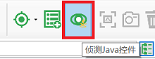
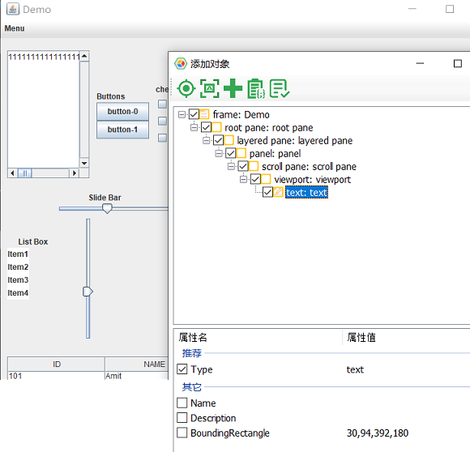

# Java Automation

Our Java Automation relies on Java Access Bridge. There please enabling Java Access Bridge before you do the Java automation.

## Enabling Java Access Bridge

By default, Java Access Bridge is not enabled. Enable it either through the command line or the Windows Control Panel. Test it by running a Java application that uses the Accessibility API.

#### Enabling Through the Command Line

Enable Java Access Bridge with the jabswitch command.

Run the following command (where %JRE_HOME% is the directory of your JRE):

```
    %JRE_HOME%\bin\jabswitch -enable
```

#### Enabling Through the Control Panel

Enable Java Access Bridge through the Control Panel with the Ease of Access Center.

1. Click Start, select Control Panel, then Ease of Access, then Ease of Access Center. Alternatively, press Windows logo key + U to access the Ease of Access Center.
2. Select Use the computer without a display.
3. In the section Other programs installed, select the check box Enable Java Access Bridge (you may have to scroll down).

## Spy Java Control

On the Model Manager, select the "Spy Java Control" from the toolbar:



Then you can select a control from the java application. After clicked a control from the Java application, the spy dialog shows and you can then click the "Add" button to add it to the model.



You may notice that the color of Java object icons is orange, which is different from Windows controls(green).

## Call Java APIs.

To generate automation code for Java controls is similiar to Windows controls.

#### Java Containers API

The container APIs are APIs for getting objects, as follows:

```javascript
interface IJContainer {
    parent: IJContainer;
    getJFrame(...conditions: ConditionFilter[]): IJFrame;
    getJButton(...conditions: ConditionFilter[]): IJButton;
    getJCheckBox(...conditions: ConditionFilter[]): IJCheckBox;
    getRadioButton(...conditions: ConditionFilter[]): IJRadioButton;
    getJEdit(...conditions: ConditionFilter[]): IJEdit;
    getJCustom(...conditions: ConditionFilter[]): IJControl;
}
```

#### Java Object Members

All java objects inherits `IJControl` interface:

```javascript
interface IJControl extends IJContainer {
    click(x?: number, y?: number, mousekey?: number): Promise<void>;
    dblClick(x?: number, y?: number, mousekey?: number): Promise<void>;
}
```

while each specific objects may have its own control method and properties, for example:

```javascript
interface IJCheckBox extends IJControl {
    checkState(): Promise<boolean>
    toggleCheck(checkState: boolean): Promise<void>
}
```

```javascript
interface IJEdit extends IJControl {
    set(value: string): Promise<void>;
    value(): Promise<string>;
}
```

The following are the samples to call Java objects:

* **Sample 1:**

   ```javascript
    const { TestModel } = require('leanpro.win');
    const model = TestModel.loadModel(__dirname + '/java_model.tmodel');

    (async function () {
        try {
            await model.java.getJEdit("text1").set('some content');
        } catch(err) {
            console.log('err', err)
        }
    })();

   ```

   To get the Java controls from model, you call should start from "model.java", which will return the root `IJContainer` object, which can in turn get other Java objects from the model.

   When you call members on Java object, and the Java object cannot locate a matching control, it will throw an "Object not found" exception. 

   If the "text1" object can locate the edit box control, it will set its content to be "some content".

* **Sample 2:**

   The following is a sample snippet that get the checkbox's checked state, and also toggle its check state to be checked.

   ```javascript
   (async function () {
        let checkbox = model.java.getJCheckBox('checkbox-0');
        console.log('checked state', await checkbox.checkState());
        await checkbox.toggleCheck(true);
   })();
   ```


