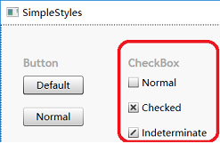
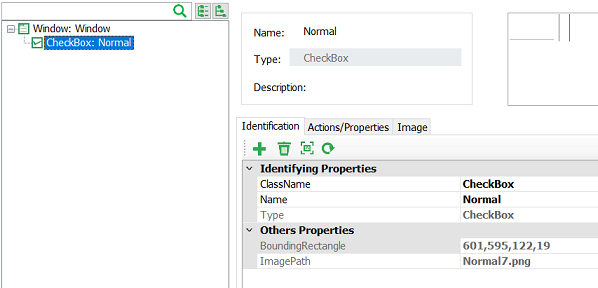

# Containers API

The container APIs are APIs for getting objects, as follows:

```javascript
export interface IWinContainer {
    parent: IWinContainer;
    getWindow(...conditions: ConditionFilter[]): IWinWindow;
    getButton(...conditions: ConditionFilter[]): IWinButton;
    getCheckBox(...conditions: ConditionFilter[]): IWinCheckBox;
    getComboBox(...conditions: ConditionFilter[]): IWinComboBox;
    getCustom(...conditions: ConditionFilter[]): IWinCustom;
    getDataItem(...conditions: ConditionFilter[]): IWinControl;
    getDataGrid(...conditions: ConditionFilter[]): IWinDataGrid
    getDocument(...conditions: ConditionFilter[]): IWinDocument;
    getEdit(...conditions: ConditionFilter[]): IWinEdit;
    getGeneric(...conditions: ConditionFilter[]): IWinGeneric;
    getImage(...conditions: ConditionFilter[]): IWinImage;
    getList(...conditions: ConditionFilter[]): IWinList;
    getListItem(...conditions: ConditionFilter[]): IWinListItem;
    getMenuBar(...conditions: ConditionFilter[]): IWinMenuBar;
    getMenuItem(...conditions: ConditionFilter[]): IWinMenuItem
    getMenu(...conditions: ConditionFilter[]): IWinMenu;
    getPane(...conditions: ConditionFilter[]): IWinPane;
    getRadioButton(...conditions: ConditionFilter[]): IWinRadioButton;
    getScrollBar(...conditions: ConditionFilter[]): IWinScrollBar;
    getSlider(...conditions: ConditionFilter[]): IWinSlider;
    getTab(...conditions: ConditionFilter[]): IWinTab;
    getTabItem(...conditions: ConditionFilter[]): IWinTabItem;
    getTable(...conditions: ConditionFilter[]): IWinTable;
    getTree(...conditions: ConditionFilter[]): IWinTree;
    getTreeItem(...conditions: ConditionFilter[]): IWinTreeItem;
    getText(...conditions: ConditionFilter[]): IWinText;
    getVirtual(...conditions: ConditionFilter[]): IWinVirtual
}
```

Here are explanation of these APIs:

## parent

returns the parent container object.

## getControls

Returns an array of container objects. It can get all the matching controls on the application according to the conditions passed in, and return the Promise of the array of objects. This API can be used when there are multiple similar controls in the interface, and an array of objects is returned at the same time.

`getControls` can be used in the following scenarios:

### 1. Multiple application is launched, need to locate one of them

For example, if you open multiple Notepad apps, each editing a different file, you find one of them to do the subsequent operations. You can add objects of the Notepad to the model, as shown below:


Note that we have removed the `Title` property from the identity property to match different objects.

Then run the following Node.js code:

```javascript
(async function() {
    let controls = await model.getControls("Notepad");
    controls.map(async (control) => console.log(await control.name()));
    let firstNodePad = controls[0];
    await firstNodePad.activate()
})()
```

This code will get all the Notepad windows, print their titles, and activate the first window bring it to the top.

#### 2. Perform actions on an array of objects

For example, there is a set of CheckBox controls on the interface, you need to select them all. Take the sample SimpleStyles as an example:



1. In order to mark all of the above checkboxes as selected, you can first add the following model objects:

   

Note that the "Name" attribute has been removed from the identification properties in order to match all CheckBox objects.

1. Use this object in the `getControls` call:

```javascript
(async function() {
    let controls = await model.getControls("Normal");
    console.log('controls', controls.length) //the number of matched controls
    for(let control of controls) {
        console.log(await control.name()); //print the name of CheckBox
        await control.check(); //check checkbox control
    }
})();
```

## get\[ControlType\]

Each container API returns one type of object, which maps to a type of control. For example, `getButton` method returns "Button" control, and `getList` method returns "List" control.

All API return one child container object. Therefore these container APIs can be called in cascade manner to obtain deeper objects in the control tree.

conditions has the following two types of parameter： 1. **object name**，string type，which is the name of some object in model. 2. **identification property**，Object type，which contains one or more key/value pairs，These properties are used to filter controls on the UI with "AND" condition.

There are several ways to call:

1. Only object name are provided，e.g.:

   ```javascript
   await model.getButton("Five").click();
   ```

2. Only identification properties:

   ```javascript
   await model.getWindow({
    "className": "ApplicationFrameWindow",
    "title": "Calculator"
   }).getWindow({
    "className": "Windows.UI.Core.CoreWindow",
    "title": "Calculator"
   }).getGeneric({
    "type": "Group",
    "automationId": "NumberPad",
    "name": "Number pad"
   }).getButton({
    "automationId": "num5Button"
   }).click();
   ```

   In the above example, each method call is passed with an object parameter. Each object contains multiple key/value pairs, which are combined to form a filter condition to find the object.

3. **Mixed mode**, that is, the first parameter is the object name, and the second parameter contains identification properties. The object name parameter is used to get the object from the model, and the identification properties is used to override the properties of object, if there are the same property exists in the object. The combined property set is then used to find the object.

   For example, if the following statement is used：

   ```javascript
   await model.getButton("Five", {"automationId": "num6Button"}).click();
   ```

   Then the button clicked is "6" on the calculator instead of "5". It is because the automationId has been overwritten with the new value in the second parameter. The container object API is synchronous, meaning that the `await` keyword is not required for the call.

