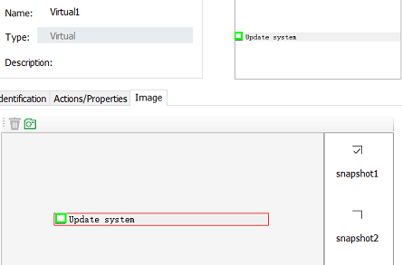

## Virtual Control API

### Virtual control creation

Virtual controls can be created in several ways:

1. Define in the model:

You can create virtual controls under a Windows control object in the object model. For related information, see [Virtual Controls](/model_mgr/virtual_control.md)
   
2. Descriptive programming

   Create a virtual control by specifying location information in the code.
   
3. call `getVirtual()` method without any parameters

   In the code you can directly call the getVirtual() method of an object without any parameters. The virtual control area created in this way has the same size as the corresponding windows control. This approach is generally used for image recognition or OCR operations on a Windows control.
   
   For example you can call:
   ```javascript
   let numPad = model.getGeneric("Number pad").getVirtual();
   await numPad.clickVisualText('4');
   ```
   
   The above example gets the virtual control from the calculator digits panel control and directly clicks on the number button by recognizing the number "4".

### Methods and Properties

Virtual control has the following APIs:
* click
* dblClick
* wheel
* takeSnapshot
* [getVirtualText](#getVirtualText)
* [clickVirtualText](#clickVirtualText)
* [findSnapshot](#findSnapshot)
* [matchSnapshot](#matchSnapshot)

Among them, the methods `click`, `dblClick`, and `wheel` work the same as other controls. The `takeSnapshot` method only intercepts the screenshot of the virtual control drawing area.

<a id="getVisualText" />
#### getVisualText 

getVisualText method has the following signature:

```javascript
getVisualText(): Promise<string>;
```

It will recognize all the text information on the screenshot image of the control area and convert it into text return.

Here is a example:

```javascript
const { TestModel, Auto } = require("leanpro.win");
let model = TestModel.loadModel(__dirname + "test.tmodel");

(async () => {
   let text = await model.getVirtual("Virtual1").getVisualText();
   console.log('text', text);
})()
```

This example uses the "Virtual1" virtual control in the model and recognize text from it.

If there are multiple blocks in a region that need to be identified separately, you can define multiple virtual controls and then call getVisualText() on these controls.

<a id="clickVisualText" />
#### clickVisualText

The clickVisualText method only exists in the Virtual control. It use OCR to find the specified text on the virtual control snapshot and click on the corresponding text.

```javascript
   clickVisualText(text: string, options?: ClickVisualTextOptions): Promise<void>;
```

among them,
* "text" is a word or phrase that can be found on the target image, the text should be on the same line on the image.
* "options" are optional parameters, including "cache", "x", "y", etc.:
* "cache" sets whether to cache text recognition information, the default value is "false"
* "x", "y" sets the click area, for example "{x: 1, y: 1}" click on the upper left corner of the text area. If x and y equal to the default value 0, click on the center of the text box.

When the cache is set to true, the text and location information recognized by the snapshot will be cached in the control. The next time you call the `clickVisualText` method and pass in the cache: true, the text position information will be reused to perform the operation without having to do OCR recognition again, which can speed up execution. The following is an example of using `cache`.

This example uses the computer that comes with Windows as an example to identify the digital panel of the calculator and add it to the model with the object name "Number pad".

```javascript
(async function () {
let numPad = model.getGeneric("Number pad").getVirtual();
   await numPad.clickVisualText('4', { cache: true });
   await numPad.clickVisualText('5', { cache: true });
   await numPad.clickVisualText('6', { cache: true });
})();
```
This example pauses when the number "4" is clicked, because it performs OCR recognition, while clicking "5" and "6" does not require OCR recognition, and the cache information is used directly. Therefore it is faster.

An exception is thrown when the text content is not found on the given control. To troubleshot the character recognition problem, you can first call `takeScreenshot` method to take a screenshot of the control, then call `getTextLocations` method on the `Ocr` class to get all the recognized text and text positions, and then diagnose, as shown in the following example:

```javascript
(async function () {
    let numPad = model.getGeneric("Number pad").getVirtual();
    let snapshot = await numPad.takeScreenshot();
    let blocks = await Ocr.getTextLocations(snapshot);
    console.log(JSON.stringify(blocks, null, 2))
})();
```

This example prints out the identification information for the text on all controls, including text and location.

For more information on OCR, see [OCR (Optical Character Recognition)](ocr.md)

#### findSnapshot

Given the key value of the virtual control snapshot in a model, the API intercepts the snapshot of the virtual control runtime and returns whether it matches this snapshot.

```javascript
   findSnapshot(): string
```
You can take multiple snapshots of a virtual control and then determine which one belongs to it at runtime:

 

Here we have two snapshots on the virtual control, one called "checked" and one called "unchecked", which can then be used in the code:

```javascript
   let snapshotKey = await model.getVirtual("Virtual1").findSnapshot();
   console.log(snapshotKey)
```

When the control is checked, the above code prints "check", and when it is not checked, the print content is "uncheck". Returns "null" if the snapshot at runtime does not match any existing snapshots in the model.

#### matchSnapshot

Returns whether the virtual control screenshot of the current runtime matches the snapshot in one of the models.

```javascript
   matchSnapshot(snapshotKey: string): boolean
```
