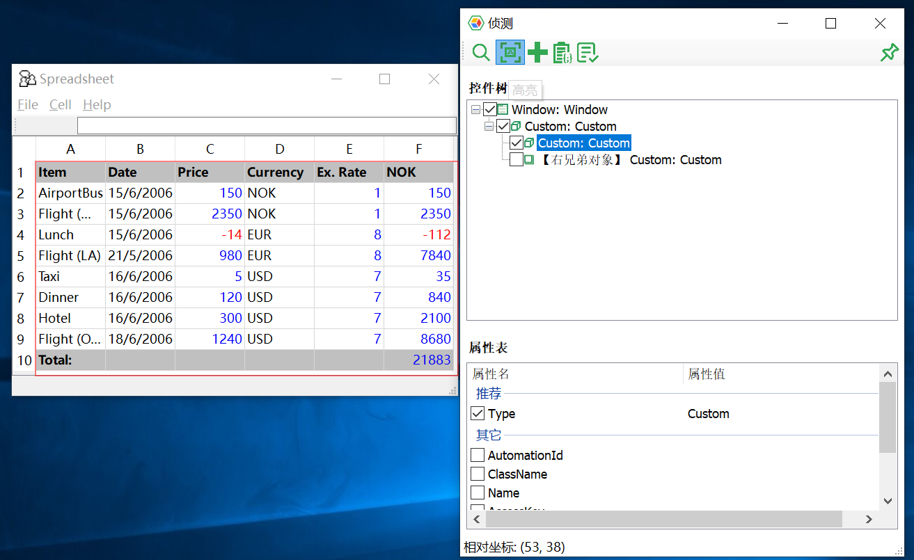
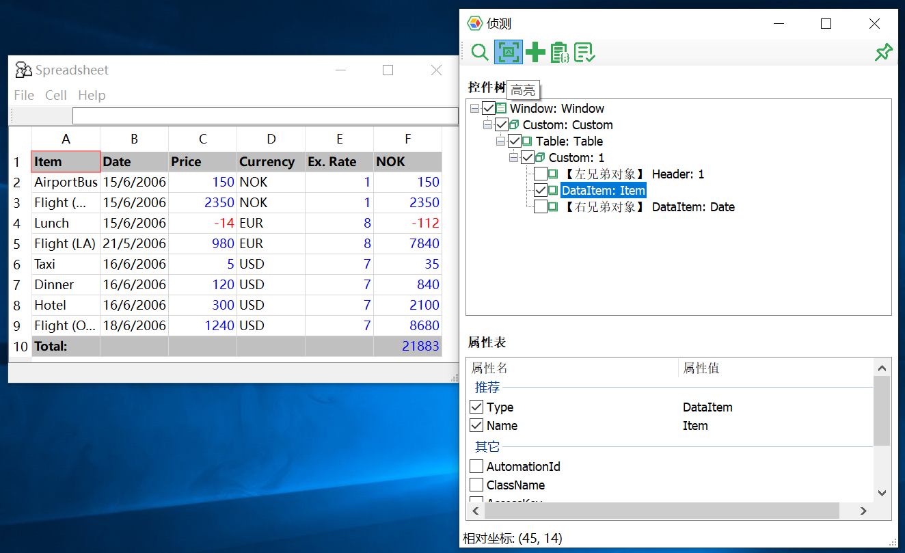

# HOWTO: Recognize QT Control Types

Sometimes when spying Qt 4.x controls, Model Manager shows all the controls `type` as `Custom`, as shown below:

  

This problems happened in Qt 4.x. The highly possible cause is that Qt Accessibility plugin has not load. To fix the problem, configure application to load Accessibility plugin. Qt Plugins typically can be found in your Qt SDK, under `..\Qt\4.x.x\plugins\accessible\`.

Now switch to your App's folder and new a subfolder named `plugins`, copy the whole `accessible` folder into it.

  

And then we need to info App to load this plugin. To do it, create a file in your app's folder, named `qt.conf`, which has the following content:

```config
[Paths]
Plugins = plugins
```  

Finally restart App and this time Model Manager should be able to `Spy` controls with correct type.   

