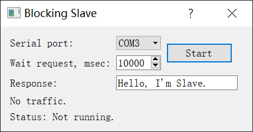
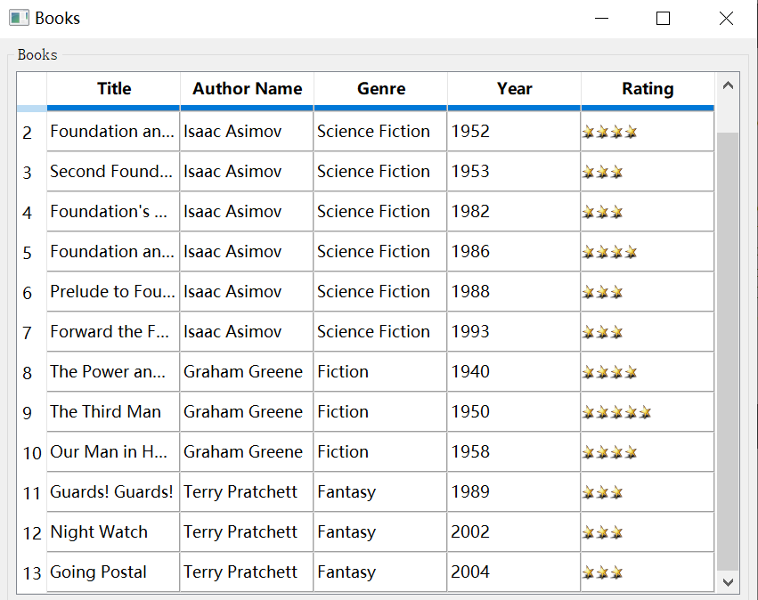

## HOWTO: Automate Qt Text Edit Controls

There are serveral different types of input boxes on Windows, such as normal Edit boxes, date format input boxes, editable cells on table control, and so on. Let's explain how to modify their text content for several common input boxes.

### How to modify Edit input boxes

For Edit boxes, it has the `Edit` control type. You can directly call the `set()` method to modify the value of the object.

Here we introduce Qt's `Spinner` control. The following code generates a random number and enters it into the input box, and then obtains the modified value from it. If the two values are consistent, it means the update is successful.



We can call the `set()` method like this:

```js
const { Workflow } = require('leanrunner');
const { TestModel} = require('leanpro.win');
const model = TestModel.loadModel(__dirname + "\\model1.tmodel");
async function main() {
    let num = parseInt(Math.random() * 10000 ).toString();
    let spinner = model.getSpinner("Spinner");

    await spinner.click(); // focus
    await spinner.set(num);
    console.log("The random number is:",num);
    console.log("The input box's value is:", await model.getGeneric("Spinner").value());
}
Workflow.run(main);
```

The result is:

```
The random number is: 1806
The input box's value is: 1806
```

An alternative solution can be: calling the control's `dblClick()` method to select the content first, and then calling the `pressKeys()` method to simulate the keyboard input to enter new content.  

```javascript
    //simulate the keyboard input
    //...
    await spinner.dblClick();
    await spinner.pressKeys(num);
```

#### Modify Cell Data
  
The cell is part of Table control and cell's control type is `DataItem`. You can double-click the cell to enter the edit mode.  

  

This control can also use the `set()` method. To do it, execute the `set()` method assignment after focusing on the target cell, as follows:  

```js
    let table = model.getTable("Table");
    let cells = await table.getControls({ type: "DataItem" });

    for(let i = 2 + 6; i < cells.length; i+=6){ 
        let cell = cells[i];
        await cell.click();
        await cell.set("Current cell's index value is: " + i).then(console.log(await cell.name()));
    }
```

The result is:  
```
    Current cell's index value is: 8
    Current cell's index value is: 14
    Current cell's index value is: 20
    Current cell's index value is: 26
    Current cell's index value is: 32
    Current cell's index value is: 38
    Current cell's index value is: 44
    Current cell's index value is: 50
    Current cell's index value is: 56
    Current cell's index value is: 62
    Current cell's index value is: 68
    Current cell's index value is: 74
    Current cell's index value is: 80
```  

> There are some tips on automating Table and Cell controls, you can refer to [Automation of QT Table Control](qt/qt_table.md) for more detail.

**Note：** If a control can't be manually edited (such as a date picker control, the date can only be selected through the expanded drop-down box and can't be entered directly), then the `set()` method can't modify the control value.  