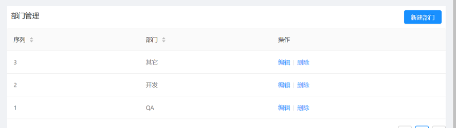
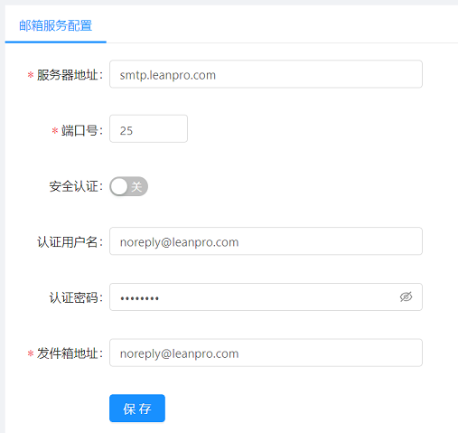
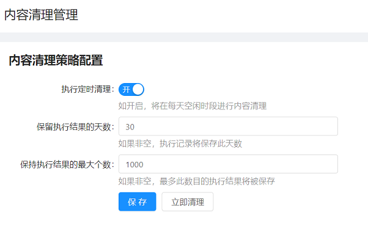
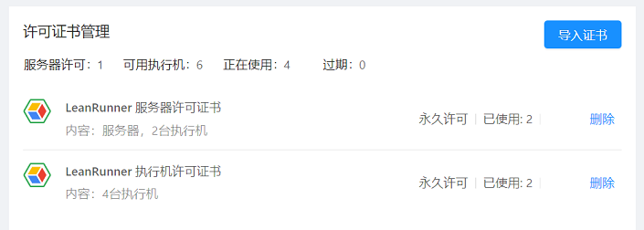

# Resource and Configuration

Used to configure the platform or manage the resource information. It mainly provides the following configurations:

1. Departments
2. Mail server
3. Proxy server management
4. Content cleanup
5. License Management

## Departments

Set department list for the organization

Actions:
* New Department: Create a new department.
* Edit: Edit and modify the department.
* Delete: Delete this department information.

## Mail server

Configure mail server information:

The mail server configured will be used to send notification emails. If an email notification set for an execution, when a LeanRunner job execution finished, a notification email will be sent to the user who triggered the execution. The user can click the link in the email to view the run detail of the job.

## Proxy Server Management

Configured for the proxy servers used during the RPA run.

Actions:
* New Agent: Create a new proxy configuration.
* Sequence: The sequence number of the agent.
* Agent Name: the alias name of the proxy.
* Proxy server: Proxy server IP address or domain name.
* Edit: Configure the proxy server.
* Delete: Delete the proxy entry.

LeanRunner can manage a list of customized configuration information. This is part of the customized configuration lists that RPA scripts can retrieve from the Controller when executed.

## Content Cleanup

It configure the strategy for content cleanup, and perform immediate cleanup operations.

The LeanRunner Controller generates report data such as log files, images, video files, etc. when execution jobs. Too much such content may fill up the disk. Here you can configure the Controller to periodically delete outdated content.

The following is the configuration cleanup strategy:

Content cleanup only removes expired execution results, but it will not delete the job itself, or the package files it depends on. Here are their configuration settings:

1. Perform regular cleaning: When this option is turned on, cleanup will be performed every night, when the system is idle.

2. Retain number of days: Set the execution data for the last few days, and the earlier execution results will be deleted. For data safety reasons, the system does not allow settings less than 10 days.

3. The maximum execution retained: retain up to the specified number of execution results, and execution results exceeding this number will be deleted. The scheduled cleanup will be performed daily, and the number of execution results before the cleanup execution may exceed this maximum.

4. Clean up now: If you want to perform cleanup immediately, click this button and the cleanup task will start in the background immediately.

## License Management

The full capability of the Controller can be acquired by installing a license for LeanRunner Controller.

There are two types of LeanRunner license:
1. Controller License
2. Agent License

The Controller license is used to unlock the full functionality of the LeanRunner Controller.

When no Controller license is installed, the Controller can work with only one agent machine. If multiple agents are connected to the Controller, one agent can be enabled and the rest agents will be disabled.

The Agent license is used to enable more agents machine. For example, when the LeanRunner Controller has a two-agents-license installed, two agent machines can connect to the Controller at the same time to run jobs which improves concurrency.
