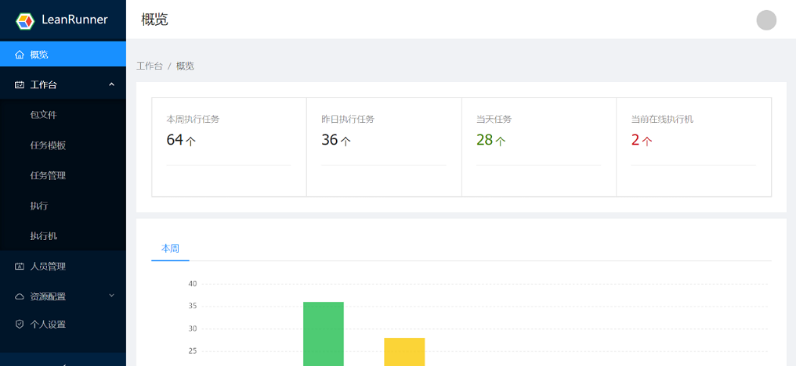

# LeanRunner Controller

LeanRunner is RPA automation software, which consists of three components: Controller, Designer and Agent. On the Controller, user can upload RPA scripts, manage Agent machines, execute jobs, monitoring execution as well as reviewing the execution results.

The functionality are described in the following categories:

* [Workbench](workbench.md)
  RPA jobs and executions management
* [User and Permissions](user_manage.md)
  User management and permission settings
* [Resources and Configuration](config.md)
  LeanRunner Controller configurations

## Overview

Click “Overview” to open the Controller dashboard, which can display the tasks performed by the RPA, such as the number of tasks executed in different time periods such as this week, yesterday, today, etc., the count of Agent machines etc.

