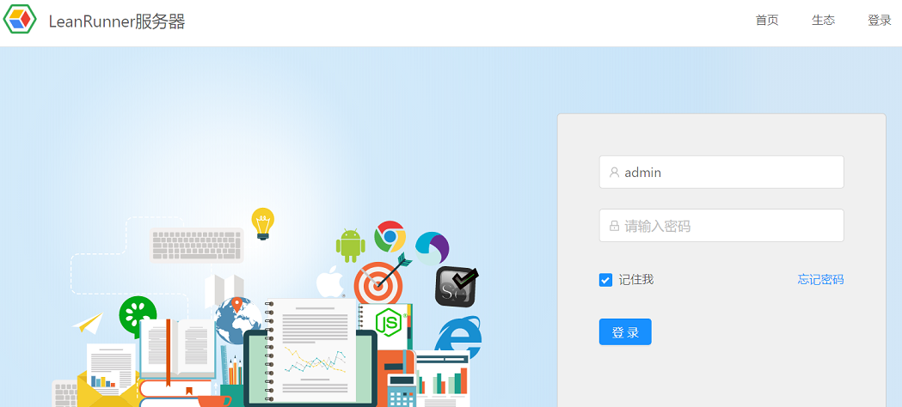
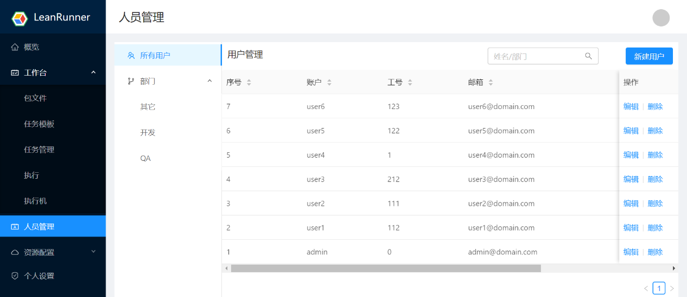
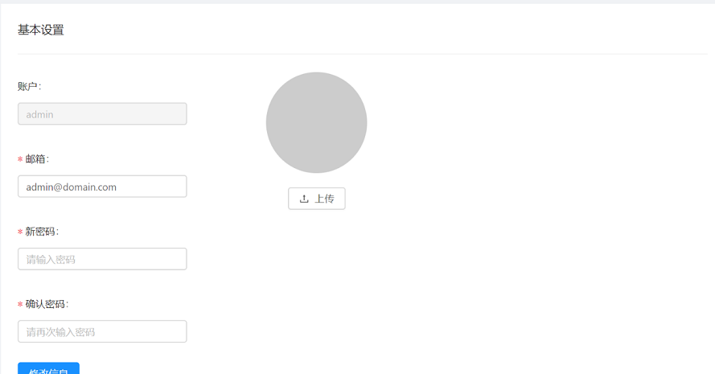

# User and Permissions

## User Login

The browser opens the LeanRunner Controller and clicks on the login menu in the upper left corner to enter the login screen. Enter your username and password, and click Login to enter the LeanRunner management interface.

Users logging in to the Controller can be administrators and general users, which have different permissions. Different roles will see the different menus and user interface that matches their permissions.

Administrator role can manage users of the Controller, including create, modify and delete users.

Actions:
* Create User: Create a new user.
* User Search: Search for users.
* Edit: Modify user information.
* Delete: Delete this user.
The fields that can be edited include: account, job number, email, phone, department, etc.

## Personal Settings

The current user views or sets his own basic information.

* Account: The user's account name.
* Email: User mailbox.
* New Password: Configure a new password.
* Confirm password: Confirm the password.
* Save: Save the modified information.
* Avatar upload: Upload new avatar image.。