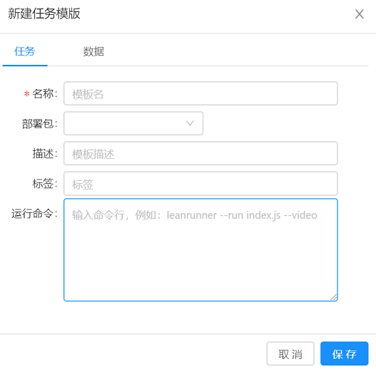
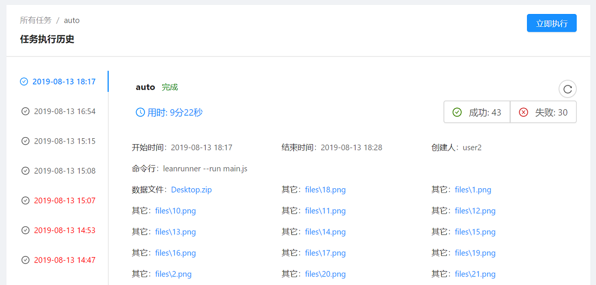

# Workbench

The Workbench is the main working area to manage job and execution on LeanRunner Controller. Includes the following:

* Package Management
* Job Template Management
* Job Management
* Execution Management
* Agent Management

## Package Management

The Package Management manage the files needed for the job execution. The package file can be:

* zip file of automation script
* Standalone Javascript file(*.js)
* The libraries automation script depends on
* Any other data files contained in the zip file

The RPA script and data files are uploaded from package management UI. From it, one can upload new packages, update existing packages, configure package names, descriptions, etc. or delete packages.

The following is a management interface for package files:

Actions:
* Uploading package: When an RPA script is created, it can be uploaded to the Controller to manage.
* Edit: When there are updated RPA script, it can be updated to the RPA package.
* Delete: Delete the package.
。
When a job started to run, the package file is downloaded to the agent machine. The package file, if in ZIP format, is extracted to the execution directory before the Agent runs the script.

### Package Configuration

Click "New Package" or click "Edit" on an existing package to open the package editing interface, as shown below:

The fields are:
* Uploading a package file will replace the old package file.
* Name: the package name, which can be any name that is easy to remember.
* Description: The functional description of the package.

>NOTE: A Job can use one or more packages. Change the name of a package does not affect the existing jobs that use the package.

### Job Template Management
Job templates can be used to quickly create a new job. Users can create commonly used job templates, which can be used to quickly create new job. The following is the management interface of the job template:

The main functionality of the job template:
* New Job Template: Create a new job template.
* Configuration: Configure the job template.
* Delete: Delete this job template.
* Create job: Create a job from this template.

New/edit job template

Job Tab:

* Name: Job template name
* Tags: Add tags for job templates
* Package: RPA package used
* Description: description information
* Run Command: command line to launch the RPA script

Data Tab
* Data Template: RPA data template file

## Job Management

The job management interface is used to create and manage RPA jobs. Users with administrator privileges can view all jobs here, and normal users can view and edit the tasks they have created.

The following is the job management interface:

Actions:
* New job: Create a new job.
* Delete: Delete this job.
* Execution: Either to execute immediately or show the execution history; "Execute" will executethis task immediately, and execution history shows the execution history of this job.

### New Job

Job Tab:
* Name: Job name
* Priority: Set a priority for this job. A smaller number indicates a higher priority.
The New Job feature is similar to the New Job Template feature. For some other fields, you can refer to the UI related to the new job template.

* Data: The data file corresponding to this Job.
* Schedule: Whether it is a scheduled job, if it is, the schedule information is displayed here.

## Execution History

Select a job, view all the execution history information related to this job:

* Select the execution time on the left, and the details of the execution can be displayed on the detailed page.
* Run: Run the current job immediately.

Click "Run" from the drop-down menu of a job:

The job execution is planned and user will be redirected to the job execution details page. If there are available idle agents, it will pick up the job and start to run.

## Executive Management

Execution management of all jobs can be managed in the "Execution" interface. Click on the details, to see the job execution.

Fields on the UI:
* recent 3 days / recent 7 days / all: Select to view partial results
* ID: Execution ID
* Title: Title of the job
* Username: User triggers this job run
* Agent: Agent machine that runs this job
* Start time: The time when the job run starts
* End time: The time the run ends
* Status: Current job execution status, divided into completion, failure, not started, forced stop.
* Details: Details of the job execution.
* Operation: There are corresponding operations for a job run based on the status, such as freeze, forced stop, and delete:
    * Freeze: If the job run is planned but has not started yet, you can choose to freeze this run. Sometimes, a job can be executed earlier by freezing other pending job runs.
    * Recovery: Restore a frozen job run to normal state, will be picked up by available agent
    * Forced Stop: The job is forcibly stopped manually.
    * Delete: Delete this job.

## Run Report

Click on an execution record in the Execution Management interface to view the report of the execution. The run details interface contains basically two parts: summary and details.

1. **Summary**

    The summary information is as follows:
    

    It has the following fields:
    * Duration: The total time taken to run this job.
    * Success: The number of successful steps.
    * Failure: The number of failed steps.
    * Skip: Skip the number.
    * Start time: Start time of the run.
    * End time: End time of the run.
    * Created by: The user who started this job run.
    * Command line: A command line that runs the script.
    * Data file: The data file used in this job run.
    * Other: Error screen shot during execution.

    The "success" and "fail" fields show the number of successful, failed steps in this execution. They are also the buttons, when clicked, filters out the corresponding steps. For example, in the initial display, all steps will be displayed. When you click "Success" button, it greys out, and succeeded steps will be hidden, and the interface will only display the failed steps.

2. **Details**

    Below the summary is the detail part, which displays the executed scenario and step information, as follows:

    

    The scenarios and steps defined in the script are displayed in the execution monitor.

    The execution status can be:
    * Not Started: The job run is just planned, not dispatched to any agent yet.
    * Done：Has run to the end
    * Failed: Execution cannot be started or continue due to a platform error. For example, the LeanRunner Designer is not installed on the execution machine, or the package file is manually deleted from the Controller.
    * Running: The execution is in progress, and the executing step information is sent to the run report page in progressively, showing the current execution status.
    * Force Stopped：If the user finds that there is an abnormality in the execution, the user can choose to manually stop the execution of the task by clicking "Stop Now" in the figure below.

    

    If the job execution fails and needs to be re-executed, open the associated task and click "Execute Now".

## Agents Management

This UI manages the agents connected to the controller:

It has the following fields:

* ID: Agent ID in database.
* Name: Name configured on Agent side, used to identify the agent.
* Machine Name: Agent machine name.
* IP address: The IP of the agent machine.
* Platform: The system platform of the agent machine, for example, win32 or Linux.
* Version: Execution machine OS version number.
* Status: The operating status of the agent, such as offline, disabled, connected, etc.
* Configuration: Execute the configuration information of the machine.
* Details: Execution machine's operation log.
* Delete: Delete this agent.

Click "Edit" on an agent entry to open the agent configuration interface. For example, you can disable an agent.

## Agent Configuration

* Status: The status of the currently agent machine, such as offline, disabled, connected, etc.
* Disable: The checkbox to disable the Agent. After disabling an Agent machine, new job will not  be dispatched to the agent to run, but job run that have started on this agent will continue to run on that machine till its completion.
* Delete: Delete this agent. This feature is used to delete an agent that is not longer in use.