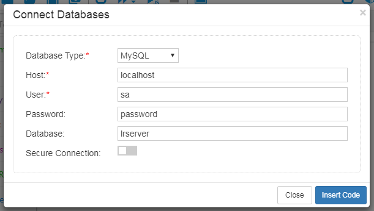
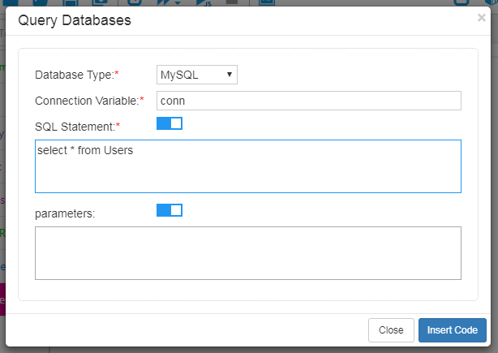

## Database Access

The toolbox provides methods for accessing databases. The following uses MySQL as an example to illustrate its use.

### Connect and query MySQL database

You can import the built-in `leanpro.mysql` package for querying MySQL database.

```js
    const mysql = require('leanpro.mysql');
```

`leanpro.mysql` wraps the `mysql` package and exports all its interfaces. In addition, it provides a `query` method that returns a Promise. The `query` method can be used to perform queries, updates, and deletes. Here is its function declaration:

```javascript
    query(connection: Connection, query: Query): Promise<any>;
    query(connection: Connection, options: string | QueryOptions): Promise<any>;
    query(connection: Connection, options: string, values: any): Promise<any>;

```

The following is a simple example. Because `leanpro.mysql` library is a thin wrapper of `mysql` package, for more detailed information, please see [mysql npm package](https://www.npmjs.com/package/mysql) .

#### Connect to a database

To create a connection to the target database, enter the database connection information, including the host name, user name, password, database name, and whether to use a secure authentication.

 

Code example:

```js
    const mysql = require('leanpro.mysql');
    let connectionSetting = {
        "host": "localhost",
        "user": "sa",
        "password": "password",
        "database": "my_database",
        "insecureAuth": true
    }
    let conn = mysql.createConnection(connectionSetting);
```

The above code snippet creates a database connection. We can then use it to access the database, which can also verify the connection.

#### Querying database

Query database using SQL statements.



Code example:

```js
    let res = await mysql.query(conn, "select * from Users");
```

Put above codes together, and then add code to print out the query results to the console. The complete code sample is as follows:

```js
    const mysql = require('leanpro.mysql');
    (async function () {
        let connectionSetting = {
            "host": "localhost",
            "user": "sa",
            "password": "password",
            "database": "my_database",
            "insecureAuth": true
        }
        let conn = mysql.createConnection(connectionSetting);
        let sql = "select * from Users";
        let res = await mysql.query(conn, sql);
        console.log(JSON.stringify(res));
        conn.end();
    })();
```  

The following is the sample results, your may get slightly different result that are specific to your database content.

```json
    [{
        "UserId": 1,
        "UserName": "admin",
        "Email": "admin@domain.com",
    }, {
        "UserId": 2,
        "UserName": "user1",
        "Email": "user1@domain.com"
    }, {
        "UserId": 3,
        "UserName": "user2",
        "Email": "user2@domain.com"
    }]
```  

Note that we called the `conn.end()` method in the code to close the database connection so that the script execution can be ended properly. In real scenario, this statement can be called to close the connection after all database operations have ended.