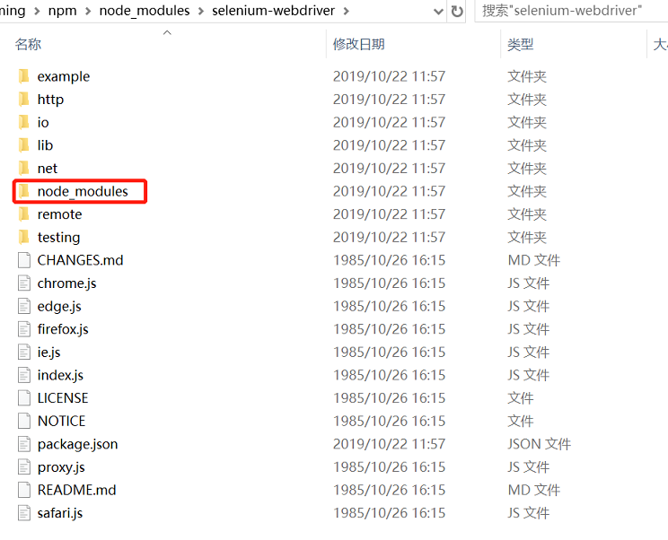

# Prepare NPM package for Offline Installation

When you use Node, and want to use some npm packages, you can use the `npm install` command to install them directly. It will download the corresponding package files from the online NPM repository automatically. 

In some cases, you can not connect to Internet directly from the development environment. So you cannot use the `npm intall` command to download and install packages and dependencies over the network.

The method described here is to package the dependencies into a `tar` file, then on the isolated environment, one can use the `npm install <your tar file>` command to install dependencies file without internet connection.

## Create Tar File

First, create `tar` file on a machine that has Internet connection. The steps are as follows:

1. **Install npm-pack-all Tool**

    `npm-pack-all` can package a npm package as a tar file. Click [here](https://www.npmjs.com/package/npm-pack-all) get more information.  

    Execute followed command to install it.

    ```
    npm install -g npm-pack-all
    ```
    > Note you should add the `-g` parameter to install it in global.  
   
2. **Install the npm-package You Want Pack**

    An npm package typically has other dependencies, all of them needs to be packaged in the tar file. We now use `selenium-Webdriver` package as an example to introduce the packaging process on **Windows**.

    It is a package that is commonly used in Web application automation, and is usually installed in a local directory of the automation scripts. To package it, we need to install it globally, with the following command:  

    ```
    npm install -g selenium-webdriver
    ```

    Installation with the `-g` parameter will place all the `selenium-webdriver` dependencies in its own directory in the global directory, which is in path similar like this: `%userprofile%\AppData\Roaming\npm\selenium-webdriver`.

    

    As you can see from the above screen, when perform global installation, all dependencies of this package are installed in the `node_modules` subdirectory of their own directory.

3. **Create Tgz File**

   * On the command prompt, change the current directory to the `selenium-webdriver` directory via `cd %appdata%\npm\node_modules\selenium-webdriver` command.

   * Execute `npm-pack-all` 

   * After the execution is completed, the `.tgz` file will be generated in the current directory. The file generated here is named `selenium-webdriver-4.0.0-alpha.5.tgz`. This file name may be different depending on the version of the npm package you actually installed.


## Install Offline

Copy the `.tgz` file which generated in the previous step to the offline machine and execute `npm install <your_tgz_file>` command under your project directory to install the package:

```
npm install selenium-webdriver-4.0.0-alpha.5.tgz
```

Then this npm package will be installed successfully.


