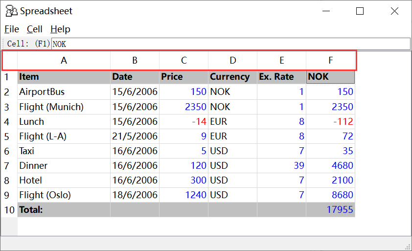

# Automation of QT Table Control

Here we will introduce tips & tricks on automating Qt Table controls. We will use table control provided by Qt Demo as an example.


### QT Table control

To automation simple controls, one will first spy control with Model Manager, add it to the model, and drag the object into the code editor to generate a `get[ControlType]` method for acquiring the object, and action methods to operate it.

The Table control is a composite control, which has child controls such as rows and cells. Using the approach described above cannot effectively manipulate the sub-elements such as the rows and cells of the Table control.

First of all, let's analyze the composition of Qt table controls.

In Qt 4.x version, the table uses `Custom` control as the row of the table. In 5.x version, `Custom` control no longer exists and all the controls in the table are stacked together.

```
Qt 4.x: 
    - Table             # table controls
        - Custom        # row controls
            - Header    # Header controls, cannot be edited
            - DataItem  # Cell controls, editable by double-clicking

Qt 5.x: 
    - Table             # table controls
        - Header        # Header controls, cannot be edited
        - DataItem      # Cell controls, editable by double-clicking
```

The structure in the table can also be seen in the test object tree identified by the model manager.

  
  

Due to the different structure, the methods for obtaining these cells, which is the `DataItem` control, are also slightly different.

### Automate cells in a table

To automate a cell in a Table control, you need to locate it first. There are two ways to do it.

#### Solution 1. Use the row and cell controls in the model to dynamically set the index property

Use the `get[ControlType]` API, see [Containers API](/node_api/node_container.md) for details, and dynamically provide the index property when obtaining the model object, for example, the location information of the known target cell, such as n rows m columns. Suppose we need to get the `A6` cell control in the table, we can obtained it directly using the position information. The code is as follows:

```js
    let target = {
        row: 6,
        column: 0
    }
    let row = model.getTable("Table").getCustom({ index: target.row });
    let cell = row.getDataItem({ index: target.column });
    console.log(await cell.value());
```
Result:

  

If it is Qt 5.x, due to the lack of row controls, the objects of all the DataItem controls are directly obtained from the Table control and stored in an array. The position information needs to be converted when the target control is removed:

```js
    let target = {
        row: 5,
        column: 0
    }
    let cell = await model.getTable("Table").getDataItem({index: target.row * 6 + target.column});
    console.log(await cell.name())
```

This code gets the object of the first cell in line 6. There are 6 DataItems in each row of the Table control, then the cell control in the nth row and mth column is an index of (n * 6 + m) DataItem controls.

  

### Solution 2: Get the control array with getControls method

The first method can get a single cell control and then automate this cell. Sometimes we need to automate multiple cells. You can use the `getControls` method, which returns a collection of child controls that meet the filter conditions.

If you need to traverse the Table control to get the cells that meet the conditions, you can first get all the controls, and then filter out the objects that meet the conditions. Suppose we need to output all the items in the Table whose price is greater than 0, we can get all the cell controls and filter them. The code is as follows:

```js
    let table = await model.getTable("Table");
    let rows = await table.getControls({type:"Custom"});
    await rows.map(async (row) => {
        let cells = await row.getControls({ type: "DataItem" });
        let price = await cells[2].value();
        if (parseInt(price) > 0) {
            let item = await cells[0].value();
            console.log(item, ":", price);
        }
    });
```

Result:  

  

A warning will be reported during operation. This is because the DataItem control does not exist in the first row control, which causes a warning message.

The above code first get a list of row controls. Then for each row control obtains all its cell controls, and accesses the needed cell with index. For example, the known price **Price** is listed in the third column, so the index value is 2, and the item name **Item** is listed in the first column, so the index value is 0. Use these index values to get the corresponding values.

### Summary

Here we described the approaches of obtaining the target child controls of a composite control. When the target control does not have an explicit identifier, you need to find the child control in the control tree with some dynamic properties. Besides Qt Table control, it can also be used in some other similar composite controls, such as List, Tree etc.