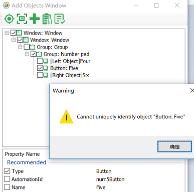
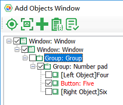
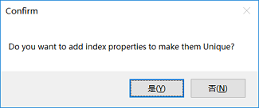
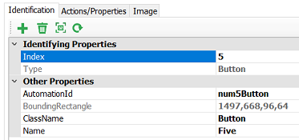

## QT Automation FAQ


<a id="tree_expand"></a>
#### Q: Why is the call to the Collapse and Expand methods of the Tree control unsuccessful?

**A**: The Windows Automation library is designed for standard controls and can support almost all QT controls, but the QT Tree control is not a standard Windows control, so not all methods support it. The Collapse and Expand methods on the TreeItem control are not supported on the QT Tree and will display the error "1003: CannotPerformThisOperation". You can expand or collapse by calling the `dblClick` method of the TreeItem control. 

<a id="combobox_select"></a>
### Q: The `select` method of QT's ComboBox object doesn't work?

**A**: QT's ComboBox is not a standard Windows control and not all methods are supported. In order to perform `select` action, you need to call combination of actions, here are the steps:

1. In the model manager, you need to add two related objects: 
   1. ComboBox control, 
   2. One of the ComboBox expanded options, namely the ListItem control.

2. In code:
   1. Call the `open` method of ComboBox to expand the drop-down box.
   2. Call getListItem to get the needed ListItem. Here in the second parameter, override the `name` property in the model object with the name value you want to select, and dynamically get ListItem element. 
   
The sample code is as follows:

```javascript
    await model.getComboBox("<ComboBoxName>").open();
    await model.getListItem("<ListItemNameInModel>", {name: '<list item name>'}).click();
```

<a id="tab_select"></a>
### Q: The "select" method of the QT Tab control cannot select those tabs that are not yet displayed.

**A**: It's true that the tab that has not scrolled into the display area cannot be selected automatically. You need to click the left and right arrow buttons on the side of the tab to move the tab to the display area and then click.

<a id="add_unique_index"></a>
### Q: There are limited identifying properties in the QT control. "index" property need to be added in order to uniquely identify the control. Are there any alternative ways?

**A**: The model manager can automatically add indexes:


1. After selecting a control, "Add Object" window appears, click the "Verify Uniqueness". If this is not unique, a message window similiar to the following appears.

   

2. Objects that cannot be uniquely identified are displayed in red.

   

3. Now when choose to add the object to the model, a dialog box appears, asking if you need to add "index":

   

4. At this time, selecting "Yes" will add necessary index when adding these objects to the model:

   

>Note: Remember to first verify the uniqueness and then added to the model to have the indexes added.

<a id="date_edit"></a>
### Q: how to set the value for Date Edit control in QT?
**A** You can double-click the front of the control by `dblClick` first, then `pressKeys` to enter the date content.


